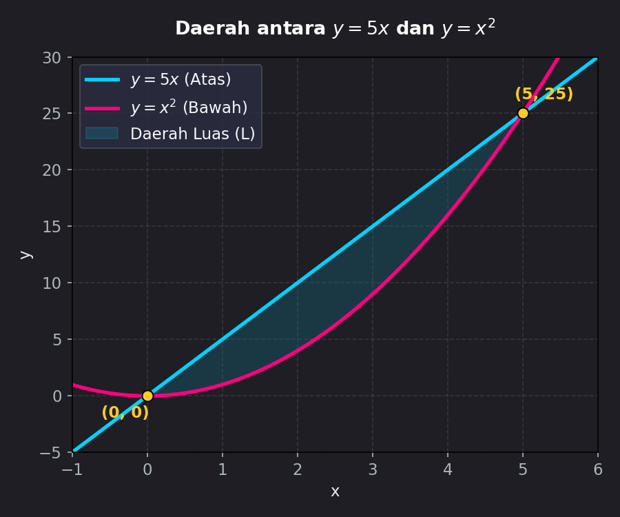
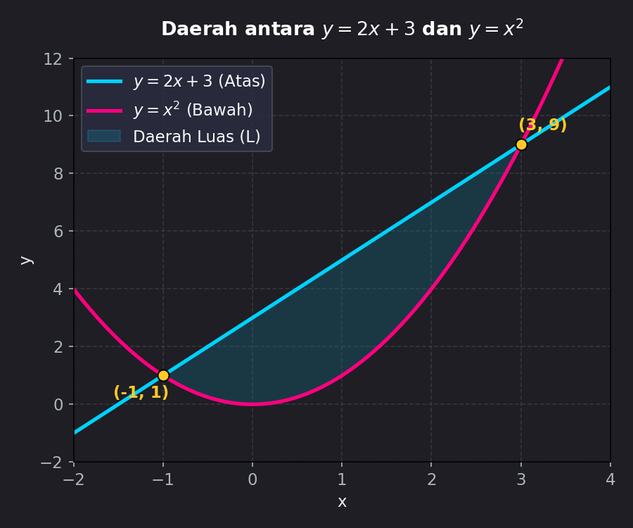

# Modul 1: Luas Antara Dua Kurva

## 1. Pendahuluan
Menghitung luas daerah di bawah satu kurva tunggal $y = f(x)$ terhadap sumbu-x adalah aplikasi dasar integral tentu. Namun, dalam banyak masalah praktis, kita sering kali perlu menghitung luas daerah yang dibatasi oleh **dua kurva** yang saling berpotongan atau berdampingan.

Sebagai contoh:
- Menghitung luas wilayah geografis yang dibatasi dua aliran sungai.
- Menganalisis surplus konsumen dan surplus produsen dalam ekonomi (daerah di antara kurva penawaran dan permintaan).

**Prasyarat:** Sebelum memulai modul ini, pastikan Anda sudah menguasai:
1. Cara menggambar grafik fungsi linear, kuadrat, dan akar.
2. Konsep dasar integral tentu dan teorema dasar kalkulus.
3. Cara mencari titik potong antara dua persamaan aljabar.

---

## 2. Konsep Dasar
Ide dasar mencari luas di antara dua kurva sangat sederhana: **kurva atas dikurangi kurva bawah**.

Bayangkan kita membagi daerah tersebut menjadi persegi panjang tegak (strip vertikal) yang sangat tipis dengan lebar $dx$.
- Tinggi dari satu persegi panjang tipis tersebut adalah selisih tinggi kurva atas dan kurva bawah, yaitu: $\text{Tinggi} = f(x) - g(x)$.
- Lebar persegi panjang tersebut adalah $dx$.
- Luas satu persegi panjang tipis (elemen luas $dA$) adalah:
  $$dA = [f(x) - g(x)] \, dx$$

Jika kita menjumlahkan semua persegi panjang tipis tersebut dari batas kiri $x = a$ ke batas kanan $x = b$ menggunakan integral tentu, kita akan mendapatkan total luas daerah ($L$).

---

## 3. Rumus Utama

### A. Integrasi Terhadap Variabel $x$ (Strip Vertikal)
Jika daerah dibatasi oleh kurva atas $y = f(x)$ dan kurva bawah $y = g(x)$ pada interval $[a, b]$, di mana $f(x) \geq g(x)$ untuk semua $x$ dalam $[a, b]$:

$$L = \int_{a}^{b} [f(x) - g(x)] \, dx$$

*   **$f(x)$**: Persamaan kurva bagian **atas**.
*   **$g(x)$**: Persamaan kurva bagian **bawah**.
*   **$a, b$**: Batas integrasi pada sumbu-x.

---

### B. Integrasi Terhadap Variabel $y$ (Strip Horizontal)
Terkadang, batas daerah lebih mudah dinyatakan sebagai fungsi dari $y$, atau kurva atas/bawah berubah-ubah jika dilihat secara vertikal. Dalam hal ini, kita menggunakan strip horizontal dengan tebal $dy$.

Jika daerah dibatasi oleh kurva kanan $x = f(y)$ dan kurva kiri $x = g(y)$ pada interval $[c, d]$, di mana $f(y) \geq g(y)$ untuk semua $y$ dalam $[c, d]$:

$$L = \int_{c}^{d} [f(y) - g(y)] \, dy$$

*   **$f(y)$**: Persamaan kurva bagian **kanan**.
*   **$g(y)$**: Persamaan kurva bagian **kiri**.
*   **$c, d$**: Batas integrasi pada sumbu-y.

---

### C. Kurva yang Saling Berpotongan di Tengah Interval
Jika kurva $f(x)$ dan $g(x)$ saling berpotongan di dalam interval $[a, b]$ (misal di $x = c$), sehingga posisi atas-bawahnya bertukar, maka kita harus membagi daerah menjadi beberapa sub-interval dan mengintegralkannya secara terpisah:

$$L = \int_{a}^{c} [f(x) - g(x)] \, dx + \int_{c}^{b} [g(x) - f(x)] \, dx$$

---

## 4. Langkah Pengerjaan Sistematis
Untuk menyelesaikan soal luas antara dua kurva dengan sukses, ikuti langkah-langkah berikut:

1.  **Sketsa Grafik:** Gambar kasar kedua kurva untuk memvisualisasikan daerah yang akan dihitung luasnya. Ini sangat membantu untuk menentukan kurva mana yang berada di "atas" atau di "kanan".
2.  **Tentukan Batas Integrasi (Titik Potong):** Samakan kedua fungsi ($f(x) = g(x)$ atau $f(y) = g(y)$) untuk mencari koordinat titik potongnya. Koordinat ini akan menjadi batas atas dan batas bawah integral.
3.  **Tentukan Kurva Atas/Bawah (atau Kanan/Kiri):** Jika sketsa grafik kurang jelas, ambil satu nilai uji $x$ (atau $y$) di antara batas-batas tersebut, lalu masukkan ke kedua persamaan. Nilai yang lebih besar adalah kurva atas (atau kanan).
4.  **Susun Integral:** Masukkan persamaan kurva dan batas yang diperoleh ke dalam rumus integral.
5.  **Hitung Integral:** Selesaikan integral tentu tersebut dan lakukan evaluasi batas. (Ingat: **Luas harus selalu bernilai positif!** Jika hasil Anda negatif, periksa kembali apakah persamaan kurva terbalik).

---

## 5. Contoh Soal & Pembahasan Langkah demi Langkah

### Contoh Soal 1: Integrasi Terhadap $x$
Tentukan luas daerah yang dibatasi oleh kurva $y = x^2$ dan garis $y = 5x$.

#### Penyelesaian:

**Langkah 1: Sketsa Grafik dan Visualisasi**
Berikut adalah grafik daerah yang dibatasi oleh $y = 5x$ dan $y = x^2$:

Dari grafik terlihat bahwa garis lurus $y = 5x$ berada di atas kurva parabola $y = x^2$.

**Langkah 2: Mencari Titik Potong (Batas Integral)**
Samakan kedua persamaan:
$$x^2 = 5x$$
$$x^2 - 5x = 0$$
Faktorkan persamaan kuadrat tersebut:
$$x(x - 5) = 0$$
Diperoleh titik potong pada $x = 0$ dan $x = 5$. 
Jadi, batas integrasinya adalah $a = 0$ dan $b = 5$.

**Langkah 3: Menentukan Kurva Atas dan Bawah**
Pada interval $[0, 5]$, kita pilih nilai uji $x = 2$:
- Untuk $y = 5x \rightarrow 5(2) = 10$  (Kurva Atas: $f(x) = 5x$)
- Untuk $y = x^2 \rightarrow (2)^2 = 4$   (Kurva Bawah: $g(x) = x^2$)

**Langkah 4: Menyusun Integral**
$$L = \int_{0}^{5} (5x - x^2) \, dx$$

**Langkah 5: Menghitung Nilai Integral**
$$L = \left[ \frac{5}{2}x^2 - \frac{1}{3}x^3 \right]_{0}^{5}$$
Masukkan batas atas ($x = 5$):
$$L = \left( \frac{5}{2}(5)^2 - \frac{1}{3}(5)^3 \right) - \left( \frac{5}{2}(0)^2 - \frac{1}{3}(0)^3 \right)$$
$$L = \left( \frac{125}{2} - \frac{125}{3} \right) - 0$$
Samakan penyebut menjadi 6:
$$L = \frac{375}{6} - \frac{250}{6} = \frac{125}{6} \approx 20.83 \text{ satuan luas}$$

**Jawaban:** Luas daerah tersebut adalah $\frac{125}{6}$ atau sekitar $20.83$ satuan luas.

---

### Contoh Soal 2: Kasus dengan Batas Negatif
Tentukan luas daerah yang dibatasi oleh kurva $y = x^2$ dan garis $y = 2x + 3$.

#### Penyelesaian:

**Langkah 1: Sketsa Grafik**
Mari visualisasikan daerah arsirannya terlebih dahulu:

Garis $y = 2x + 3$ berada di atas kurva parabola $y = x^2$.

**Langkah 2: Mencari Titik Potong**
Samakan kedua persamaan:
$$x^2 = 2x + 3$$
$$x^2 - 2x - 3 = 0$$
Faktorkan:
$$(x - 3)(x + 1) = 0$$
Maka diperoleh titik potong pada $x = -1$ dan $x = 3$.
Batas integrasinya adalah $a = -1$ dan $b = 3$.

**Langkah 3: Menentukan Kurva Atas dan Bawah**
Pilih nilai uji $x = 0$ (berada di antara $-1$ dan $3$):
- Untuk $y = 2x + 3 \rightarrow 2(0) + 3 = 3$ (Kurva Atas: $f(x) = 2x + 3$)
- Untuk $y = x^2 \rightarrow 0^2 = 0$ (Kurva Bawah: $g(x) = x^2$)

**Langkah 4: Menyusun Integral**
$$L = \int_{-1}^{3} [(2x + 3) - x^2] \, dx$$

**Langkah 5: Menghitung Integral**
$$L = \left[ x^2 + 3x - \frac{1}{3}x^3 \right]_{-1}^{3}$$
Masukkan batas atas ($x = 3$):
$$\text{Evaluasi } (3) = 3^2 + 3(3) - \frac{1}{3}(3)^3 = 9 + 9 - 9 = 9$$
Masukkan batas bawah ($x = -1$):
$$\text{Evaluasi } (-1) = (-1)^2 + 3(-1) - \frac{1}{3}(-1)^3 = 1 - 3 + \frac{1}{3} = -2 + \frac{1}{3} = -\frac{5}{3}$$
Kurangkan batas atas dengan batas bawah:
$$L = 9 - \left( -\frac{5}{3} \right) = 9 + \frac{5}{3} = \frac{27}{3} + \frac{5}{3} = \frac{32}{3} \approx 10.67 \text{ satuan luas}$$

**Jawaban:** Luas daerah tersebut adalah $\frac{32}{3}$ atau sekitar $10.67$ satuan luas.

---

## 6. Ringkasan & Tips Ujian
*   **Rumus Utama:** $L = \int_{a}^{b} (\text{Kurva Atas} - \text{Kurva Bawah}) \, dx$.
*   **Arah Pandang:** Jika batas kiri-kanan tidak konsisten tapi batas atas-bawah konsisten, gunakan integrasi terhadap $y$: $L = \int_{c}^{d} (\text{Kurva Kanan} - \text{Kurva Kiri}) \, dy$.
*   **Kesalahan Umum:**
    1.  **Lupa mencari titik potong:** Jangan langsung berasumsi batasnya adalah titik koordinat acak, selalu selesaikan persamaannya terlebih dahulu.
    2.  **Terbalik Atas-Bawah:** Jika hasil integral bernilai negatif, kemungkinan Anda menukar fungsi atas dan bawah. Luas fisik daerah nyata selalu positif!
    3.  **Kesalahan tanda aljabar:** Saat melakukan pengurangan $[f(x) - g(x)]$, pastikan Anda mendistribusikan tanda negatif ke seluruh suku $g(x)$. Contoh: $2x + 3 - (x^2 - 1) = -x^2 + 2x + 4$.
