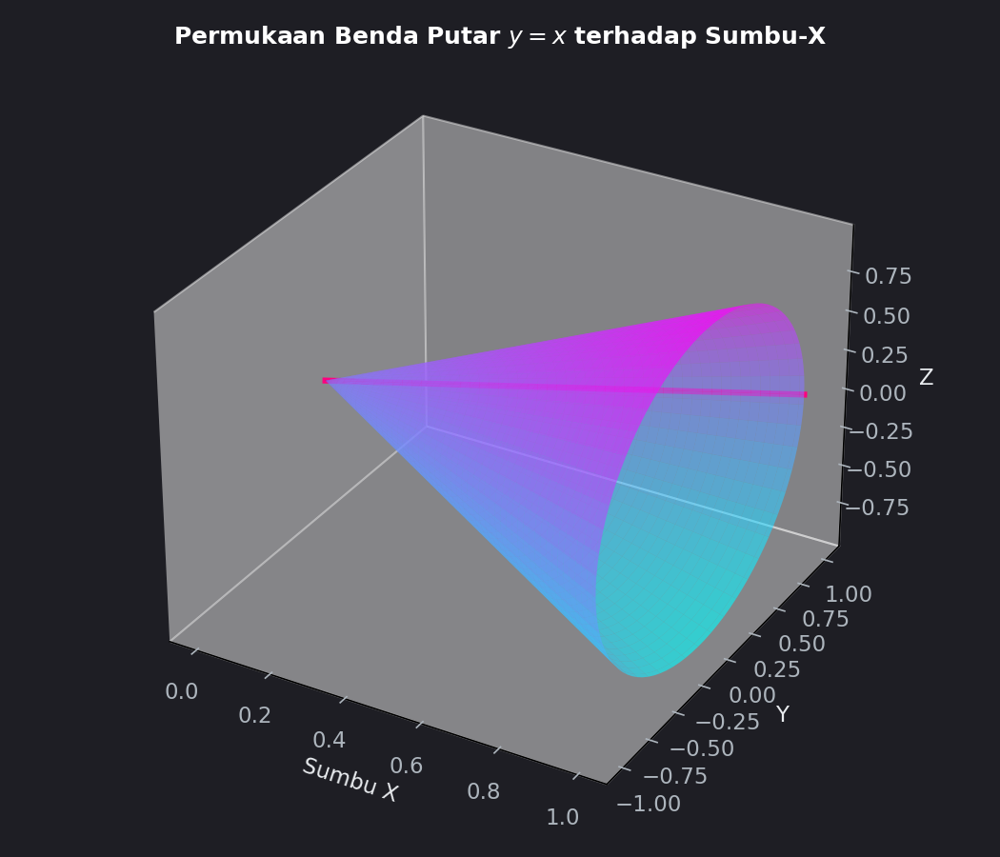
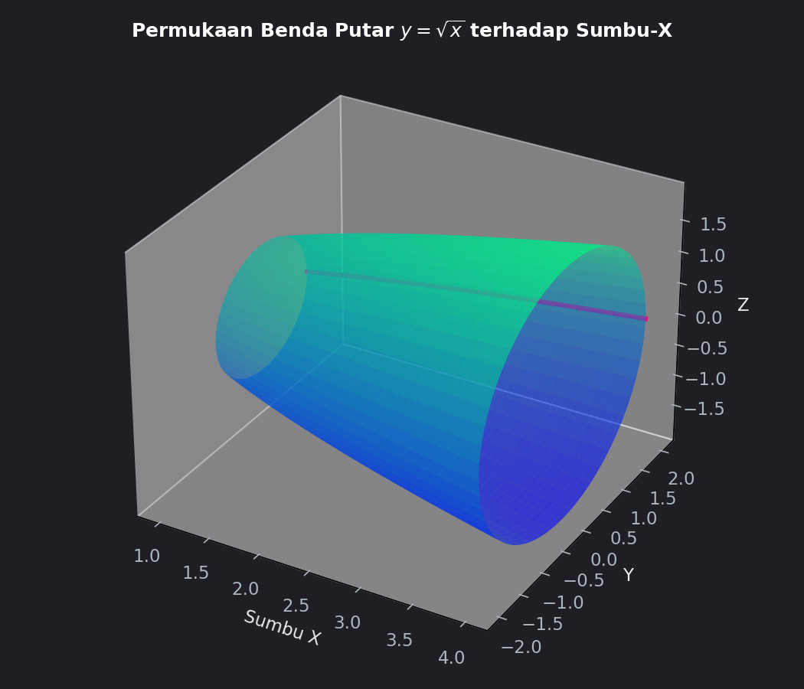

# Modul 2: Luas Permukaan Benda Putar

## 1. Pendahuluan
Bila suatu kurva dua dimensi diputar mengelilingi sebuah garis lurus (sumbu putar), ia akan menyapu ruang dan membentuk objek tiga dimensi yang disebut **benda putar** (*solid of revolution*). 
- Dalam matematika, kita dapat menghitung **volume** dari benda tersebut (misal dengan metode cakram atau kulit tabung).
- Namun pada modul ini, kita akan fokus mencari **luas permukaan** (*surface area of revolution*), yaitu luas "kulit" atau "selimut" terluar dari objek 3D tersebut.

**Contoh di dunia nyata:**
- Menghitung jumlah cat yang dibutuhkan untuk melapisi tangki air berbentuk parabola.
- Menentukan bahan logam minimum yang diperlukan untuk memproduksi corong berbentuk hiperbolik.

**Prasyarat:**
1. Aturan rantai turunan (*chain rule*).
2. Konsep **Panjang Busur** (*arc length*), karena elemen panjang busur $ds$ adalah kunci untuk menghitung luas permukaan.
3. Teknik integrasi substitusi aljabar dan trigonometri.

---

## 2. Konsep Dasar & Derivasi Rumus
Bagaimana rumus luas permukaan benda putar diturunkan? Pendekatan James Stewart dalam *Calculus* menjelaskan metode ini secara geometris:

1.  **Aproksimasi Segmen:** Kita membagi kurva asli $y = f(x)$ menjadi banyak segmen garis lurus kecil.
2.  **Pembentukan Frustum:** Ketika satu segmen garis lurus kecil ini diputar mengelilingi sumbu, ia tidak membentuk silinder sempurna, melainkan **frustum kerucut** (kerucut terpotong).
3.  **Luas Satu Frustum:** Luas permukaan lateral ($A$) dari sebuah frustum kerucut dengan jari-jari lingkaran ujung $r_1$ dan $r_2$, serta panjang selimut miring $L$ adalah:
    $$A = 2\pi \cdot r_{\text{rata-rata}} \cdot L$$
    di mana $r_{\text{rata-rata}} = \frac{r_1 + r_2}{2}$.
4.  **Menuju Integral:** Ketika lebar sub-interval mendekati nol, panjang garis miring $L$ menjadi elemen panjang busur $ds$, dan $r_{\text{rata-rata}}$ menjadi fungsi jari-jari $r(x)$ (jarak dari titik di kurva ke sumbu putar).
    Dengan menjumlahkan seluruh luas frustum kecil ini melalui limit Riemann, kita memperoleh rumus integral umum:
    $$S = \int 2\pi r \, ds$$

---

## 3. Rumus Utama

Elemen panjang busur $ds$ didefinisikan sebagai:
- Jika kurva dinyatakan sebagai fungsi $x$, $y = f(x)$:
  $$ds = \sqrt{1 + \left(\frac{dy}{dx}\right)^2} \, dx$$
- Jika kurva dinyatakan sebagai fungsi $y$, $x = g(y)$:
  $$ds = \sqrt{1 + \left(\frac{dx}{dy}\right)^2} \, dy$$

---

### A. Rotasi Mengelilingi Sumbu-X
Jika kurva diputar terhadap sumbu-x, jarak dari setiap titik pada kurva ke sumbu putar adalah nilai koordinat $y$-nya sendiri. Maka, jari-jari putarnya adalah $r = y$.

1.  **Jika Kurva $y = f(x)$ pada batas $x \in [a, b]$:**
    $$S = \int_{a}^{b} 2\pi y \sqrt{1 + \left(\frac{dy}{dx}\right)^2} \, dx$$

2.  **Jika Kurva $x = g(y)$ pada batas $y \in [c, d]$:**
    $$S = \int_{c}^{d} 2\pi y \sqrt{1 + \left(\frac{dx}{dy}\right)^2} \, dy$$

---

### B. Rotasi Mengelilingi Sumbu-Y
Jika kurva diputar terhadap sumbu-y, jarak dari setiap titik pada kurva ke sumbu putar adalah nilai koordinat $x$-nya sendiri. Maka, jari-jari putarnya adalah $r = x$.

1.  **Jika Kurva $y = f(x)$ pada batas $x \in [a, b]$:**
    $$S = \int_{a}^{b} 2\pi x \sqrt{1 + \left(\frac{dy}{dx}\right)^2} \, dx$$

2.  **Jika Kurva $x = g(y)$ pada batas $y \in [c, d]$:**
    $$S = \int_{c}^{d} 2\pi x \sqrt{1 + \left(\frac{dx}{dy}\right)^2} \, dy$$

---

## 4. Langkah Pengerjaan Sistematis
1.  **Tentukan Sumbu Putar:** Apakah diputar terhadap sumbu-x atau sumbu-y?
    - Putar sumbu-x $\rightarrow$ Jari-jari $r = y$.
    - Putar sumbu-y $\rightarrow$ Jari-jari $r = x$.
2.  **Pilih Variabel Integrasi ($dx$ atau $dy$):** Sesuaikan dengan batas integral yang diberikan dan kemudahan fungsi untuk diturunkan serta diintegralkan.
3.  **Hitung Turunan Pertama:** Cari $\frac{dy}{dx}$ (untuk $dx$) atau $\frac{dx}{dy}$ (untuk $dy$).
4.  **Bentuk Elemen Panjang Busur ($ds$):** Hitung $\sqrt{1 + (\text{turunan})^2}$.
5.  **Substitusi Fungsi:** Pastikan semua variabel di dalam integral seragam. Jika mengintegralkan terhadap $dx$, ubah semua variabel $y$ menjadi fungsi $f(x)$. Sebaliknya, jika terhadap $dy$, ubah variabel $x$ menjadi $g(y)$.
6.  **Hitung Nilai Integral.**

---

## 5. Contoh Soal & Pembahasan Langkah demi Langkah

### Contoh Soal 1: Putar Terhadap Sumbu-X (Mudah)
Tentukan luas permukaan benda putar yang terbentuk dari kurva $y = x$ pada selang $0 \leq x \leq 1$ ketika diputar mengelilingi sumbu-x.

#### Penyelesaian:

**Langkah 1: Visualisasi Objek 3D**
Berikut adalah gambaran grafis permukaan benda putar yang dihasilkan:

Kurva asli adalah garis lurus $y = x$. Ketika diputar terhadap sumbu-x, ia membentuk sebuah **kerucut terbuka** dengan jari-jari alas $1$ dan tinggi $1$.

**Langkah 2: Identifikasi Parameter**
- Sumbu putar: Sumbu-x $\rightarrow$ Jari-jari $r = y$.
- Variabel integrasi: kita pilih $x$ karena batasnya adalah $x \in [0, 1]$. Maka kita perlu menuliskan jari-jari $r = y$ dalam bentuk $x$, yaitu $r = x$.

**Langkah 3: Hitung Turunan Pertama**
$$y = x \implies \frac{dy}{dx} = 1$$

**Langkah 4: Hitung Elemen Panjang Busur ($ds$)**
$$ds = \sqrt{1 + \left(\frac{dy}{dx}\right)^2} \, dx = \sqrt{1 + 1^2} \, dx = \sqrt{2} \, dx$$

**Langkah 5: Susun Integral**
$$S = \int_{0}^{1} 2\pi y \, ds$$
Substitusi $y = x$ dan $ds = \sqrt{2} \, dx$:
$$S = \int_{0}^{1} 2\pi x \sqrt{2} \, dx = 2\pi \sqrt{2} \int_{0}^{1} x \, dx$$

**Langkah 6: Hitung Integral**
$$S = 2\pi \sqrt{2} \left[ \frac{1}{2}x^2 \right]_{0}^{1}$$
$$S = 2\pi \sqrt{2} \left( \frac{1}{2}(1)^2 - 0 \right) = \pi \sqrt{2} \approx 4.44 \text{ satuan luas}$$

*Verifikasi Geometri:* Luas selimut kerucut adalah $\pi r L$, di mana jari-jari alas $r = 1$ dan panjang garis pelukis $L = \sqrt{1^2 + 1^2} = \sqrt{2}$. Jadi, Luas = $\pi (1)(\sqrt{2}) = \pi \sqrt{2}$. Hasil integral terbukti **benar**!

---

### Contoh Soal 2: Kasus Bentuk Akar
Tentukan luas permukaan benda putar yang terbentuk jika kurva $y = \sqrt{x}$ untuk $1 \leq x \leq 4$ diputar mengelilingi sumbu-x.

#### Penyelesaian:

**Langkah 1: Visualisasi Grafik**

Kurva adalah setengah parabola tidur $y = \sqrt{x}$. Saat diputar terhadap sumbu-x, ia membentuk sebuah wadah paraboloid.

**Langkah 2: Identifikasi Parameter**
- Sumbu putar: Sumbu-x $\rightarrow$ Jari-jari $r = y$.
- Integrasi terhadap $x$ dengan batas $1 \leq x \leq 4$. 
- Ubah $y$ ke variabel $x$: $r = \sqrt{x}$.

**Langkah 3: Hitung Turunan Pertama**
$$y = \sqrt{x} = x^{1/2} \implies \frac{dy}{dx} = \frac{1}{2\sqrt{x}}$$

**Langkah 4: Hitung Elemen Panjang Busur ($ds$)**
$$ds = \sqrt{1 + \left(\frac{1}{2\sqrt{x}}\right)^2} \, dx = \sqrt{1 + \frac{1}{4x}} \, dx = \sqrt{\frac{4x + 1}{4x}} \, dx = \frac{\sqrt{4x + 1}}{2\sqrt{x}} \, dx$$

**Langkah 5: Susun Integral**
$$S = \int_{1}^{4} 2\pi y \, ds$$
Substitusi $y = \sqrt{x}$ dan $ds = \frac{\sqrt{4x + 1}}{2\sqrt{x}} \, dx$:
$$S = \int_{1}^{4} 2\pi \sqrt{x} \left( \frac{\sqrt{4x + 1}}{2\sqrt{x}} \right) \, dx$$
Sederhanakan ($\sqrt{x}$ di pembilang dan penyebut saling menghilangkan):
$$S = \pi \int_{1}^{4} \sqrt{4x + 1} \, dx$$

**Langkah 6: Hitung Integral dengan Metode Substitusi**
Misalkan:
$$u = 4x + 1 \implies du = 4 \, dx \implies dx = \frac{du}{4}$$
Batas integrasi juga disesuaikan:
- Jika $x = 1 \implies u = 4(1) + 1 = 5$
- Jika $x = 4 \implies u = 4(4) + 1 = 17$

Masukkan variabel baru:
$$S = \pi \int_{5}^{17} \sqrt{u} \, \frac{du}{4} = \frac{\pi}{4} \int_{5}^{17} u^{1/2} \, du$$
$$S = \frac{\pi}{4} \left[ \frac{2}{3} u^{3/2} \right]_{5}^{17} = \frac{\pi}{6} \left[ u\sqrt{u} \right]_{5}^{17}$$
$$S = \frac{\pi}{6} \left( 17\sqrt{17} - 5\sqrt{5} \right) \approx 30.85 \text{ satuan luas}$$

**Jawaban:** Luas permukaannya adalah $\frac{\pi}{6} (17\sqrt{17} - 5\sqrt{5})$ atau sekitar $30.85$ satuan luas.

---

## 6. Ringkasan & Tips Ujian
*   **Rumus Ingatan Cepat:**
    - Putar sumbu-x: $S = \int 2\pi y \, ds$
    - Putar sumbu-y: $S = \int 2\pi x \, ds$
*   **Kombinasi Variabel:** Hati-hati menukar variabel di dalam integral. Ingat prinsipnya: **Sumbu Putar menentukan apakah yang dipakai $x$ atau $y$ sebagai jari-jari**, sedangkan **notasi $ds$ menentukan apakah kita menggunakan integrasi terhadap $dx$ atau $dy$**.
*   **Sering Terjadi Kesalahan:**
    1.  **Lupa Jari-jari:** Beberapa siswa langsung mengintegralkan panjang busur $\int ds$ tanpa mengalikannya dengan $2\pi r$. Ingat ini adalah luas permukaan (2D), bukan panjang busur (1D).
    2.  **Tidak Menyederhanakan Integran:** Selalu periksa apakah ada bagian aljabar yang bisa saling menghilangkan seperti pada Contoh Soal 2 ($\sqrt{x}$ tercoret). Jika tidak dicoret, integralnya akan terlihat jauh lebih sulit dari yang sebenarnya.
