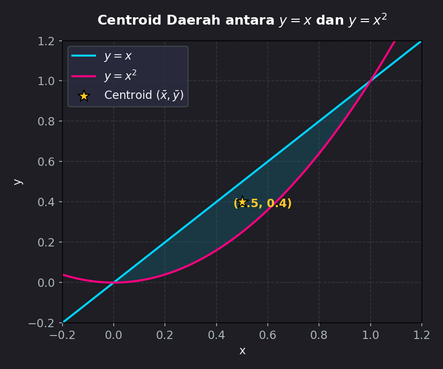
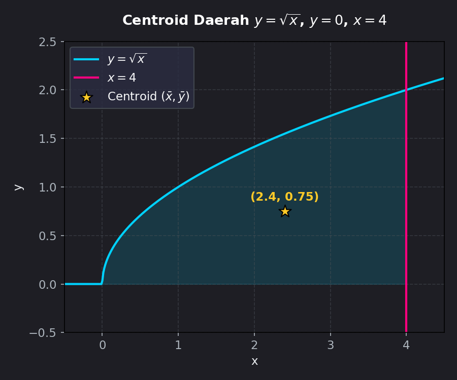

# Modul 3: Titik Berat (Centroid)

## 1. Pendahuluan
Pernahkah Anda mencoba menyeimbangkan sebuah penggaris atau sebuah benda datar tipis di atas ujung jari Anda? Titik di mana benda tersebut berada dalam keseimbangan sempurna dan tidak jatuh disebut **titik berat** atau **pusat massa** (*center of mass*).

Dalam matematika, jika kita memiliki pelat datar tipis (disebut **lamina**) dengan kerapatan massa (densitas) yang seragam atau konstan di setiap titiknya, titik berat geometris dari daerah tersebut dinamakan **centroid**.

**Aplikasi di dunia nyata:**
- Teknik Sipil: Menentukan pusat gravitasi penampang jembatan atau gedung agar struktur seimbang dan stabil terhadap gaya luar (angin, gempa).
- Desain Pesawat & Kapal: Menempatkan titik berat pada posisi optimal agar kendaraan tidak mudah terbalik.

**Prasyarat:**
1. Menghitung luas daerah menggunakan integral tentu (dari Modul 1).
2. Integral fungsi polinomial sederhana dan bentuk pecahan.

---

## 2. Konsep Dasar & Prinsip Momen
Untuk memahami centroid, kita harus memahami konsep fisika dasar tentang **Momen**:

*   **Massa ($m$):** Total materi dari lamina. Jika densitas lamina adalah konstan ($\rho$), maka:
    $$m = \rho \times \text{Luas}$$
*   **Momen ($M$):** Ukuran kecenderungan suatu massa untuk menghasilkan rotasi terhadap suatu sumbu putar. Momen didefinisikan sebagai hasil kali $\text{massa} \times \text{jarak tegak lurus ke sumbu}$.
    - **Momen terhadap sumbu-y ($M_y$):** Mengukur kecenderungan lamina berputar terhadap sumbu-y (ke kanan atau ke kiri). Jarak horizontal dari titik $(x,y)$ ke sumbu-y adalah $x$.
    - **Momen terhadap sumbu-x ($M_x$):** Mengukur kecenderungan lamina berputar terhadap sumbu-x (ke atas atau ke bawah). Jarak vertikal dari titik $(x,y)$ ke sumbu-x adalah $y$.

Titik berat $(\bar{x}, \bar{y})$ didefinisikan sebagai titik di mana seluruh massa lamina dapat dianggap terkonsentrasi. Oleh karena itu, momen total sistem harus sama dengan momen massa yang terkonsentrasi di titik berat tersebut:
$$m \bar{x} = M_y \implies \bar{x} = \frac{M_y}{m}$$
$$m \bar{y} = M_x \implies \bar{y} = \frac{M_x}{m}$$

Karena densitas $\rho$ konstan di seluruh bagian lamina, nilai $\rho$ akan saling membatalkan (*cancel out*) pada pembilang dan penyebut. Dengan demikian, koordinat centroid hanya bergantung pada **geometri daerah** tersebut, bukan massanya.

---

## 3. Rumus Utama

Untuk daerah yang dibatasi oleh kurva atas $y = f(x)$ dan kurva bawah $y = g(x)$ pada selang $[a, b]$ dengan densitas konstan $\rho$:

---

### A. Luas Daerah ($A$)
$$A = \int_{a}^{b} [f(x) - g(x)] \, dx$$

---

### B. Momen Terhadap Sumbu-Y ($M_y$)
$$M_y = \int_{a}^{b} x [f(x) - g(x)] \, dx$$
*Intuitif:* Kita mengalikan elemen luas dengan jarak horizontalnya ($x$) ke sumbu-y.

---

### C. Momen Terhadap Sumbu-X ($M_x$)
$$M_x = \int_{a}^{b} \frac{1}{2} \left[ [f(x)]^2 - [g(x)]^2 \right] \, dx$$

> [!NOTE]
> **Mengapa ada faktor $\frac{1}{2}$ dan kuadrat di rumus $M_x$?**
> Jika kita mengambil potongan vertikal tipis (strip vertikal) pada posisi $x$:
> 1. Panjang strip adalah $f(x) - g(x)$.
> 2. Pusat massa dari strip vertikal homogen ini berada tepat di tengah-tengah tinggi strip, yaitu pada koordinat rata-rata:
>    $$\tilde{y} = \frac{f(x) + g(x)}{2}$$
> 3. Momen strip terhadap sumbu-x adalah jarak $\tilde{y}$ dikalikan elemen luas $dA$:
>    $$dM_x = \tilde{y} \, dA = \left( \frac{f(x) + g(x)}{2} \right) [f(x) - g(x)] \, dx$$
>    $$dM_x = \frac{1}{2} \left[ [f(x)]^2 - [g(x)]^2 \right] \, dx$$

---

### D. Koordinat Centroid $(\bar{x}, \bar{y})$
$$\bar{x} = \frac{M_y}{A} = \frac{\int_{a}^{b} x [f(x) - g(x)] \, dx}{\int_{a}^{b} [f(x) - g(x)] \, dx}$$

$$\bar{y} = \frac{M_x}{A} = \frac{\int_{a}^{b} \frac{1}{2} \left[ [f(x)]^2 - [g(x)]^2 \right] \, dx}{\int_{a}^{b} [f(x) - g(x)] \, dx}$$

---

## 4. Langkah Pengerjaan Sistematis
1.  **Sketsa Grafik:** Gambar daerahnya untuk mengidentifikasi kurva atas $f(x)$, kurva bawah $g(x)$, serta batas kiri $a$ dan batas kanan $b$.
2.  **Hitung Luas ($A$):** Integralkan selisih fungsi dari $a$ ke $b$. Simpan hasil ini sebagai pembagi akhir.
3.  **Hitung Momen $M_y$:** Kalikan selisih fungsi dengan $x$, lalu integralkan.
4.  **Hitung Momen $M_x$:** Kuadratkan masing-masing fungsi, kurangkan, kalikan dengan $\frac{1}{2}$, lalu integralkan.
5.  **Cari Koordinat Centroid:** Bagi masing-masing momen dengan luas daerah:
    $$\bar{x} = \frac{M_y}{A} \quad \text{dan} \quad \bar{y} = \frac{M_x}{A}$$
6.  **Pemeriksaan Logika:** Pastikan titik $(\bar{x}, \bar{y})$ yang didapat berada di **dalam** daerah arsiran grafik. Jika titiknya berada di luar daerah, pasti ada kesalahan hitung.

---

## 5. Contoh Soal & Pembahasan Langkah demi Langkah

### Contoh Soal 1: Daerah di Antara Dua Kurva
Tentukan centroid dari daerah yang dibatasi oleh garis $y = x$ dan kurva parabola $y = x^2$.

#### Penyelesaian:

**Langkah 1: Sketsa Grafik**
Daerah arsirannya ditunjukkan pada grafik berikut beserta posisi centroid-nya:

Daerah ini dibatasi oleh batas kiri $x = 0$ dan batas kanan $x = 1$. Di dalam interval ini, garis $y = x$ bertindak sebagai kurva atas ($f(x)$) dan parabola $y = x^2$ bertindak sebagai kurva bawah ($g(x)$).

**Langkah 2: Menghitung Luas ($A$)**
$$A = \int_{0}^{1} (x - x^2) \, dx$$
$$A = \left[ \frac{1}{2}x^2 - \frac{1}{3}x^3 \right]_{0}^{1} = \left( \frac{1}{2} - \frac{1}{3} \right) - 0 = \frac{1}{6}$$

**Langkah 3: Menghitung Momen terhadap Sumbu-Y ($M_y$)**
$$M_y = \int_{0}^{1} x(x - x^2) \, dx = \int_{0}^{1} (x^2 - x^3) \, dx$$
$$M_y = \left[ \frac{1}{3}x^3 - \frac{1}{4}x^4 \right]_{0}^{1} = \left( \frac{1}{3} - \frac{1}{4} \right) - 0 = \frac{1}{12}$$

**Langkah 4: Menghitung Momen terhadap Sumbu-X ($M_x$)**
$$M_x = \int_{0}^{1} \frac{1}{2} \left[ x^2 - (x^2)^2 \right] \, dx = \frac{1}{2} \int_{0}^{1} (x^2 - x^4) \, dx$$
$$M_x = \frac{1}{2} \left[ \frac{1}{3}x^3 - \frac{1}{5}x^5 \right]_{0}^{1} = \frac{1}{2} \left( \frac{1}{3} - \frac{1}{5} \right) = \frac{1}{2} \left( \frac{2}{15} \right) = \frac{1}{15}$$

**Langkah 5: Menghitung Koordinat Centroid $(\bar{x}, \bar{y})$**
$$\bar{x} = \frac{M_y}{A} = \frac{1/12}{1/6} = \frac{1}{12} \times \frac{6}{1} = \frac{1}{2} = 0.5$$
$$\bar{y} = \frac{M_x}{A} = \frac{1/15}{1/6} = \frac{1}{15} \times \frac{6}{1} = \frac{6}{15} = \frac{2}{5} = 0.4$$

**Jawaban:** Koordinat centroid daerah tersebut adalah $(\bar{x}, \bar{y}) = (0.5, 0.4)$. (Lihat tanda bintang kuning pada grafik).

---

### Contoh Soal 2: Daerah Berupa Setengah Parabola
Tentukan centroid dari daerah yang dibatasi oleh kurva $y = \sqrt{x}$, sumbu-x ($y = 0$), dan garis vertikal $x = 4$.

#### Penyelesaian:

**Langkah 1: Sketsa Grafik**

Kurva atas: $f(x) = \sqrt{x}$. Kurva bawah: $g(x) = 0$. Interval integrasi: $x \in [0, 4]$.

**Langkah 2: Menghitung Luas ($A$)**
$$A = \int_{0}^{4} \sqrt{x} \, dx = \int_{0}^{4} x^{1/2} \, dx$$
$$A = \left[ \frac{2}{3}x^{3/2} \right]_{0}^{4} = \frac{2}{3}(4)^{3/2} - 0 = \frac{2}{3}(8) = \frac{16}{3}$$

**Langkah 3: Menghitung Momen terhadap Sumbu-Y ($M_y$)**
$$M_y = \int_{0}^{4} x \sqrt{x} \, dx = \int_{0}^{4} x^{3/2} \, dx$$
$$M_y = \left[ \frac{2}{5}x^{5/2} \right]_{0}^{4} = \frac{2}{5}(4)^{5/2} - 0 = \frac{2}{5}(32) = \frac{64}{5}$$

**Langkah 4: Menghitung Momen terhadap Sumbu-X ($M_x$)**
$$M_x = \int_{0}^{4} \frac{1}{2} \left[ (\sqrt{x})^2 - 0^2 \right] \, dx = \frac{1}{2} \int_{0}^{4} x \, dx$$
$$M_x = \frac{1}{2} \left[ \frac{1}{2}x^2 \right]_{0}^{4} = \frac{1}{4}(4)^2 = 4$$

**Langkah 5: Menghitung Koordinat Centroid $(\bar{x}, \bar{y})$**
$$\bar{x} = \frac{M_y}{A} = \frac{64/5}{16/3} = \frac{64}{5} \times \frac{3}{16} = \frac{4 \times 3}{5} = \frac{12}{5} = 2.4$$
$$\bar{y} = \frac{M_x}{A} = \frac{4}{16/3} = 4 \times \frac{3}{16} = \frac{3}{4} = 0.75$$

**Jawaban:** Koordinat centroid daerah tersebut adalah $(\bar{x}, \bar{y}) = (2.4, 0.75)$.

---

## 6. Ringkasan & Tips Ujian
*   **Ringkasan Rumus Tanpa Densitas ($\rho$):**
    - $A = \int (f - g) \, dx$
    - $\bar{x} = \frac{1}{A} \int x(f - g) \, dx$
    - $\bar{y} = \frac{1}{A} \int \frac{1}{2}(f^2 - g^2) \, dx$
*   **Sifat Simetri (Sangat Berguna!):**
    Jika suatu daerah memiliki **sumbu simetri**, maka centroid daerah tersebut **pasti terletak pada sumbu simetri itu**.
    - *Contoh:* Centroid dari belahan lingkaran atas $x^2 + y^2 = r^2$ ($y \geq 0$) pasti memiliki $\bar{x} = 0$ karena daerahnya simetris terhadap sumbu-y. Anda hanya perlu mencari $\bar{y}$.
*   **Kesalahan Umum:**
    1.  **Menulis $\bar{x}$ sebagai $\frac{M_x}{A}$:** Ini terbalik! Sumbu-x adalah sumbu horizontal, tapi momen terhadap sumbu-x ($M_x$) mengukur rotasi vertikal (y). Jadi, $\bar{x}$ dipasangkan dengan $M_y$, sedangkan $\bar{y}$ dipasangkan dengan $M_x$.
    2.  **Lupa mengkuadratkan fungsi di $M_x$:** Ingat, rumusnya adalah selisih kuadrat: $f(x)^2 - g(x)^2$, **bukan** kuadrat dari selisih: $(f(x) - g(x))^2$. Ini perbedaan aljabar yang sangat fatal!
