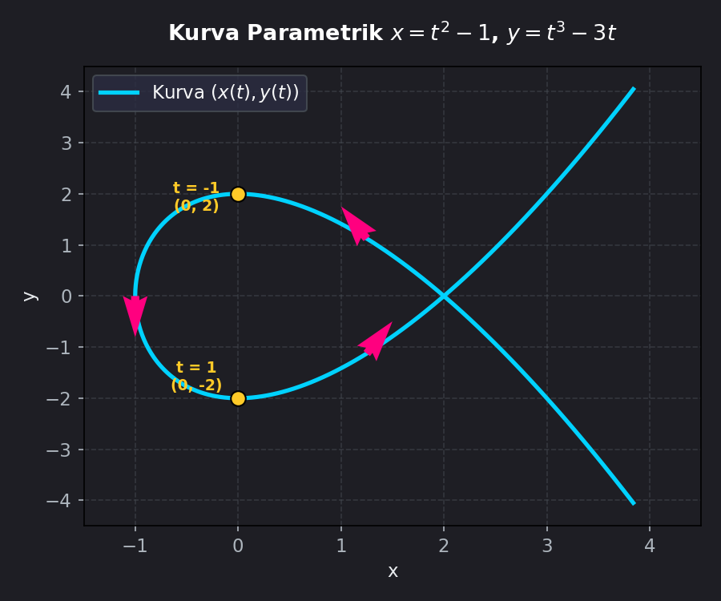
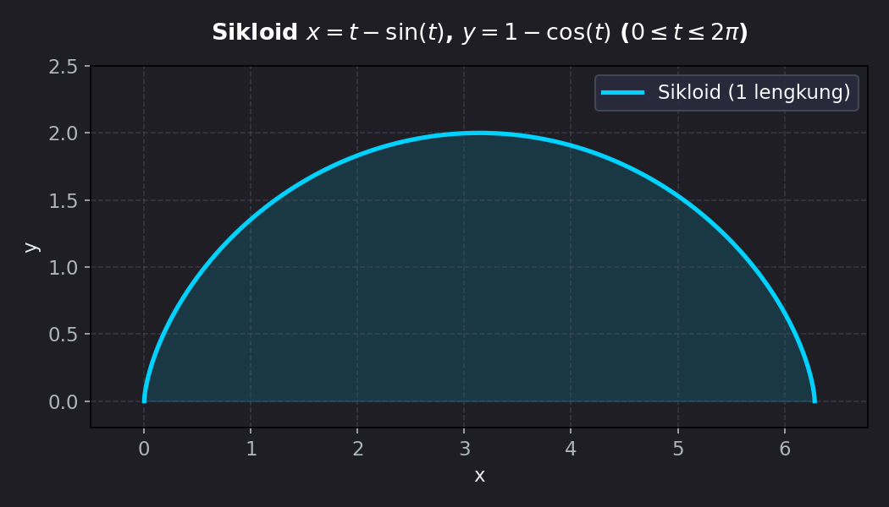

# Modul 4: Persamaan Parametrik

## 1. Pendahuluan
Sejauh ini kita mendefinisikan kurva di bidang dua dimensi menggunakan satu persamaan Kartesian yang menghubungkan variabel $x$ dan $y$ secara langsung, baik eksplisit (seperti $y = f(x)$) maupun implisit (seperti $x^2 + y^2 = r^2$).

Namun, ada kalanya posisi suatu titik $(x, y)$ pada kurva lebih mudah dinyatakan ketika keduanya merupakan fungsi dari variabel ketiga, sebut saja $t$. Variabel ketiga ini dinamakan **parameter**. Persamaan yang mendefinisikannya disebut **persamaan parametrik**:
$$x = f(t) \quad \text{dan} \quad y = g(t)$$

**Analogi dunia nyata:**
Bayangkan seekor semut berjalan di atas selembar kertas. Posisi horizontal ($x$) dan posisi vertikal ($y$) dari semut tersebut berubah seiring berjalannya waktu ($t$). Koordinat $(x,y)$ pada waktu $t$ menuliskan lintasan semut secara parametrik.

**Keunggulan utama:**
- Bisa menggambarkan kurva kompleks yang bukan fungsi (misalnya lingkaran, bentuk spiral, atau sikloid yang berulang).
- Menunjukkan arah gerakan (orientasi) kurva saat parameter $t$ bertambah.

**Prasyarat:**
1. Aturan rantai turunan (*chain rule*).
2. Integral tentu dasar dan identitas trigonometri.

---

## 2. Konsep Dasar & Eliminasi Parameter
Untuk mengenali bentuk kurva dari persamaan parametrik, kita bisa melakukan **eliminasi parameter** untuk mengubahnya menjadi persamaan Kartesian standar.

*Contoh Sederhana:*
Diberikan persamaan parametrik:
$$x = t^2 - 1 \quad \text{dan} \quad y = 2t$$
Kita dapat mengisolasi $t$ dari persamaan kedua: $t = \frac{y}{2}$.
Substitusikan ke persamaan pertama:
$$x = \left(\frac{y}{2}\right)^2 - 1 \implies x = \frac{y^2}{4} - 1 \implies y^2 = 4(x + 1)$$
Ini adalah persamaan parabola tidur yang terbuka ke kanan.

---

## 3. Rumus Utama Kalkulus Parametrik

Ketika kurva dinyatakan secara parametrik oleh $x = f(t)$ dan $y = g(t)$, kita dapat melakukan kalkulus (mencari kemiringan garis singgung, kecekungan, luas, dan panjang lintasan) langsung tanpa harus mengeliminasi parameter $t$.

---

### A. Turunan Pertama (Kemiringan Tangen)
Untuk mencari kemiringan garis singgung ($\frac{dy}{dx}$) pada titik $(x(t), y(t))$:
$$\frac{dy}{dx} = \frac{dy/dt}{dx/dt} = \frac{g'(t)}{f'(t)} \quad (\text{dengan syarat } dx/dt \neq 0)$$

*   Garis singgung **horizontal** terjadi ketika $\frac{dy}{dt} = 0$ (dan $\frac{dx}{dt} \neq 0$).
*   Garis singgung **vertikal** terjadi ketika $\frac{dx}{dt} = 0$ (dan $\frac{dy}{dt} \neq 0$).

---

### B. Turunan Kedua (Kecekungan Kurva)
Untuk mencari kecekungan (*concavity*) kurva, kita menurunkan kembali hasil $\frac{dy}{dx}$ terhadap $x$. Menggunakan aturan rantai:
$$\frac{d^2y}{dx^2} = \frac{\frac{d}{dx}\left(\frac{dy}{dx}\right)}{dx/dt}$$

---

### C. Luas di Bawah Kurva Parametrik
Luas daerah di bawah kurva $y = g(t)$ dari $t = \alpha$ hingga $t = \beta$ (di mana kurva ditelusuri sekali dari kiri ke kanan saat $t$ bertambah):
$$A = \int_{\alpha}^{\beta} y(t) \cdot x'(t) \, dt = \int_{\alpha}^{\beta} g(t) \cdot f'(t) \, dt$$

---

### D. Panjang Busur (Arc Length)
Untuk kurva mulus yang tidak menumpuk dirinya sendiri ketika $t$ bertambah dari $\alpha$ ke $\beta$:
$$L = \int_{\alpha}^{\beta} \sqrt{\left(\frac{dx}{dt}\right)^2 + \left(\frac{dy}{dt}\right)^2} \, dt$$

---

### E. Luas Permukaan Benda Putar Parametrik
Jika kurva diputar mengelilingi sumbu koordinat:
*   **Diputar terhadap Sumbu-X ($y \geq 0$):**
    $$S = \int_{\alpha}^{\beta} 2\pi y(t) \sqrt{\left(\frac{dx}{dt}\right)^2 + \left(\frac{dy}{dt}\right)^2} \, dt$$
*   **Diputar terhadap Sumbu-Y ($x \geq 0$):**
    $$S = \int_{\alpha}^{\beta} 2\pi x(t) \sqrt{\left(\frac{dx}{dt}\right)^2 + \left(\frac{dy}{dt}\right)^2} \, dt$$

---

## 4. Langkah Pengerjaan Sistematis
1.  **Analisis Fungsi:** Tuliskan fungsi $x(t)$ dan $y(t)$ beserta turunannya terhadap $t$, yaitu $x'(t)$ dan $y'(t)$.
2.  **Tentukan Parameter Batas:** Jika batas $t$ ($\alpha$ dan $\beta$) tidak diberikan langsung, gunakan informasi koordinat titik potong Kartesian yang diketahui untuk memecahkan nilai $t$.
3.  **Gunakan Rumus yang Sesuai:**
    - Untuk garis singgung $\rightarrow$ cari $\frac{dy}{dx}$ dengan membagi $\frac{dy/dt}{dx/dt}$.
    - Untuk panjang busur/luas permukaan $\rightarrow$ hitung dahulu bagian di dalam akar kuadrat $[x'(t)]^2 + [y'(t)]^2$, sederhanakan sebisa mungkin (biasanya menggunakan identitas trigonometri $\sin^2 t + \cos^2 t = 1$), lalu integralkan.

---

## 5. Contoh Soal & Pembahasan Langkah demi Langkah

### Contoh Soal 1: Turunan & Garis Singgung Horizontal/Vertikal
Diberikan kurva parametrik $x = t^2 - 1$ dan $y = t^3 - 3t$.
1. Cari $\frac{dy}{dx}$.
2. Tentukan titik-titik koordinat $(x,y)$ di mana garis singgungnya horizontal.

#### Penyelesaian:

**Langkah 1: Sketsa Grafik**
Berikut adalah lintasan kurva parametrik beserta titik singgung horizontalnya:

Tanda panah pink menunjukkan orientasi arah gerakan kurva seiring bertambahnya nilai $t$.

**Langkah 2: Hitung Turunan terhadap $t$**
$$\frac{dx}{dt} = 2t \quad \text{dan} \quad \frac{dy}{dt} = 3t^2 - 3$$

**Langkah 3: Hitung Turunan Pertama $\frac{dy}{dx}$**
$$\frac{dy}{dx} = \frac{dy/dt}{dx/dt} = \frac{3t^2 - 3}{2t}$$

**Langkah 4: Cari Titik Singgung Horizontal**
Garis singgung horizontal terjadi jika pembilang dari $\frac{dy}{dx}$ bernilai nol, yaitu $\frac{dy}{dt} = 0$:
$$3t^2 - 3 = 0 \implies t^2 = 1 \implies t = 1 \quad \text{atau} \quad t = -1$$

Sekarang cari koordinat $(x,y)$ untuk masing-masing nilai $t$:
- **Untuk $t = -1$:**
  $$x = (-1)^2 - 1 = 0$$
  $$y = (-1)^3 - 3(-1) = -1 + 3 = 2$$
  Diperoleh koordinat titik **$(0, 2)$**.
- **Untuk $t = 1$:**
  $$x = (1)^2 - 1 = 0$$
  $$y = (1)^3 - 3(1) = 1 - 3 = -2$$
  Diperoleh koordinat titik **$(0, -2)$**.

**Jawaban:** $\frac{dy}{dx} = \frac{3t^2 - 3}{2t}$, dan garis singgung horizontal berada di titik $(0, 2)$ dan $(0, -2)$.

---

### Contoh Soal 2: Panjang Busur (Trigonometri)
Tentukan panjang busur lingkaran satuan yang didefinisikan oleh $x = \cos t$ dan $y = \sin t$ untuk $0 \leq t \leq 2\pi$.

#### Penyelesaian:

**Langkah 1: Hitung Turunan terhadap $t$**
$$\frac{dx}{dt} = -\sin t \quad \text{dan} \quad \frac{dy}{dt} = \cos t$$

**Langkah 2: Hitung Suku di Dalam Akar**
$$\left(\frac{dx}{dt}\right)^2 + \left(\frac{dy}{dt}\right)^2 = (-\sin t)^2 + (\cos t)^2 = \sin^2 t + \cos^2 t = 1$$

**Langkah 3: Susun dan Hitung Integral Panjang Busur**
$$L = \int_{0}^{2\pi} \sqrt{1} \, dt$$
$$L = \int_{0}^{2\pi} 1 \, dt = [t]_{0}^{2\pi} = 2\pi \text{ satuan panjang}$$

**Jawaban:** Panjang busur lingkaran tersebut adalah $2\pi$ (yang persis sama dengan rumus keliling lingkaran $2\pi r$ dengan $r=1$).

---

### Contoh Soal 3: Luas di Bawah Kurva Sikloid
Hitung luas daerah di bawah satu lengkung kurva sikloid yang dibentuk oleh $x = t - \sin t$ dan $y = 1 - \cos t$ untuk $0 \leq t \leq 2\pi$.

#### Penyelesaian:

**Langkah 1: Sketsa Grafik**

Kurva ini disapu oleh satu titik pada roda yang menggelinding. Kita akan menghitung luas daerah arsir biru di bawah sikloid.

**Langkah 2: Hitung Turunan $x'(t)$**
$$x = t - \sin t \implies x'(t) = 1 - \cos t$$

**Langkah 3: Susun Integral Luas**
$$A = \int_{0}^{2\pi} y(t) \cdot x'(t) \, dt$$
Substitusi $y = 1 - \cos t$ dan $x' = 1 - \cos t$:
$$A = \int_{0}^{2\pi} (1 - \cos t)(1 - \cos t) \, dt = \int_{0}^{2\pi} (1 - \cos t)^2 \, dt$$

**Langkah 4: Jabarkan Integran dan Gunakan Identitas Trigonometri**
$$(1 - \cos t)^2 = 1 - 2\cos t + \cos^2 t$$
Gunakan identitas sudut ganda: $\cos^2 t = \frac{1 + \cos 2t}{2}$
$$(1 - \cos t)^2 = 1 - 2\cos t + \frac{1}{2} + \frac{1}{2}\cos 2t = \frac{3}{2} - 2\cos t + \frac{1}{2}\cos 2t$$

**Langkah 5: Hitung Integral**
$$A = \int_{0}^{2\pi} \left( \frac{3}{2} - 2\cos t + \frac{1}{2}\cos 2t \right) \, dt$$
$$A = \left[ \frac{3}{2}t - 2\sin t + \frac{1}{4}\sin 2t \right]_{0}^{2\pi}$$
Evaluasi batas atas ($t = 2\pi$):
$$\text{Evaluasi}(2\pi) = \frac{3}{2}(2\pi) - 2\sin(2\pi) + \frac{1}{4}\sin(4\pi) = 3\pi - 0 + 0 = 3\pi$$
Evaluasi batas bawah ($t = 0$):
$$\text{Evaluasi}(0) = 0 - 0 + 0 = 0$$
Maka, $A = 3\pi - 0 = 3\pi \approx 9.42$ satuan luas.

**Jawaban:** Luas di bawah satu lengkung sikloid tersebut adalah $3\pi$ satuan luas.

---

## 6. Ringkasan & Tips Ujian
*   **Ringkasan Rumus:**
    - Kemiringan: $\frac{dy}{dx} = \frac{y'}{x'}$
    - Kecekungan: $\frac{d^2y}{dx^2} = \frac{\frac{d}{dt}(y'/x')}{x'}$
    - Panjang Busur: $L = \int \sqrt{(x')^2 + (y')^2} \, dt$
    - Luas: $A = \int y \cdot x' \, dt$
*   **Kesalahan Umum di Ujian:**
    1.  **Salah rumus turunan kedua:** Banyak mahasiswa yang berpikir $\frac{d^2y}{dx^2}$ hanyalah $\frac{y''(t)}{x''(t)}$. Ini salah besar! Ingat Anda harus menurunkan hasil $\frac{dy}{dx}$ terhadap $t$, lalu membaginya sekali lagi dengan $x'(t)$.
    2.  **Menukar batas integrasi:** Saat menggunakan rumus luas $A = \int_{\alpha}^{\beta} y \cdot x' \, dt$, pastikan batas $\alpha$ berhubungan dengan batas kiri Kartesian $x = a$, dan $\beta$ berhubungan dengan batas kanan Kartesian $x = b$. Jika orientasi terbalik, hasil integral Anda akan negatif.
