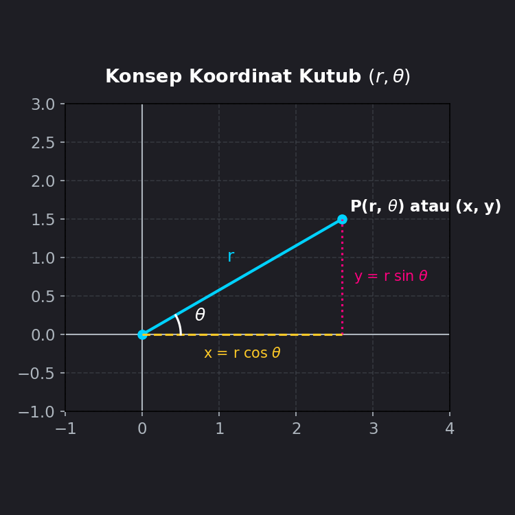
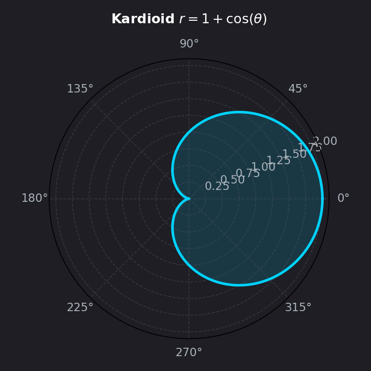
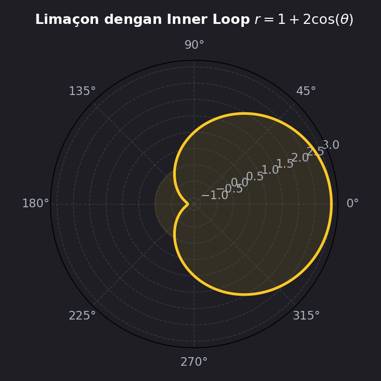
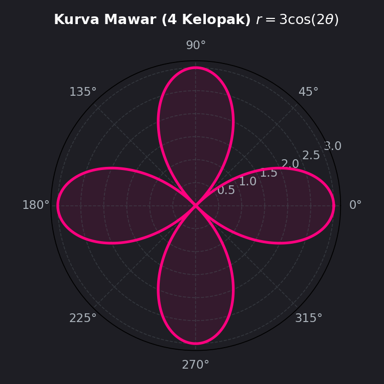

# Modul 5: Grafik dalam Koordinat Kutub

## 1. Pendahuluan
Selama ini, kita terbiasa menunjuk suatu titik di bidang menggunakan koordinat Kartesian $(x, y)$, di mana kita bergerak sejajar sumbu-x lalu sejajar sumbu-y. 

Namun untuk kurva-kurva yang memiliki pusat simetri radial (seperti lingkaran, kelopak bunga, spiral, atau jantung), koordinat Kartesian menjadi sangat rumit. Dalam kasus ini, kita menggunakan sistem koordinat alternatif yang sangat elegan: **Sistem Koordinat Kutub (Polar)**.

Di dalam koordinat kutub, posisi suatu titik dinyatakan dengan pasangan $(r, \theta)$:
-   **$r$ (Jarak Radial):** Jarak lurus dari titik asal (disebut **Kutub** atau *Pole*) ke titik tersebut.
-   **$\theta$ (Sudut Polar):** Sudut berarah dari sumbu horizontal positif (disebut **Sumbu Polar**) menuju garis penghubung kutub ke titik tersebut (diukur berlawanan arah jarum jam).

**Aplikasi di dunia nyata:**
- Radar dan Sonar: Navigasi kapal laut dan pesawat terbang menggunakan sudut dan jarak (koordinat polar) untuk mendeteksi objek.
- Pola Radiasi Antena: Kekuatan sinyal antena nirkabel biasanya memancar membentuk kurva kardioid atau mawar di bidang polar.

---

## 2. Konsep Dasar & Konversi Koordinat
Hubungan antara koordinat Kartesian $(x,y)$ dan koordinat kutub $(r, \theta)$ dapat diturunkan menggunakan segitiga siku-siku pada diagram berikut:

### Rumus Konversi:
*   **Kutub ke Kartesian (Polar $\rightarrow$ Cartesian):**
    $$x = r \cos\theta$$
    $$y = r \sin\theta$$
*   **Kartesian ke Kutub (Cartesian $\rightarrow$ Polar):**
    $$r^2 = x^2 + y^2 \implies r = \sqrt{x^2 + y^2}$$
    $$\tan\theta = \frac{y}{x} \implies \theta = \arctan\left(\frac{y}{x}\right)$$

*Catatan penting tentang kuadran:* Saat mencari nilai $\theta$, perhatikan letak titik $(x,y)$ di kuadran Kartesian untuk memastikan sudut $\theta$ berada di kuadran yang benar.

---

## 3. Uji Simetri Grafik Kutub
Menguji simetri sebelum menggambar grafik dapat menghemat waktu pengerjaan ujian secara signifikan. Ada tiga jenis uji simetri utama pada kurva polar:

1.  **Simetri terhadap Sumbu Polar (Sumbu-X):**
    Ganti $\theta$ dengan $-\theta$ dalam persamaan. Jika persamaan tidak berubah (karena $\cos(-\theta) = \cos\theta$), maka grafik simetris terhadap sumbu horizontal.
2.  **Simetri terhadap Garis $\theta = \frac{\pi}{2}$ (Sumbu-Y):**
    Ganti $\theta$ dengan $\pi - \theta$. Jika persamaan tidak berubah (karena $\sin(\pi - \theta) = \sin\theta$), maka grafik simetris terhadap sumbu vertikal.
3.  **Simetri terhadap Titik Asal (Kutub/Pole):**
    Ganti $r$ dengan $-r$, atau ganti $\theta$ dengan $\theta + \pi$. Jika persamaan tetap ekuivalen, grafik simetris terhadap titik asal.

---

## 4. Jenis-Jenis Kurva Kutub Penting

Berikut adalah beberapa bentuk kurva standar yang sering keluar di ujian kalkulus:

---

### A. Lingkaran (Circles)
*   **$r = a$**: Lingkaran dengan pusat di kutub $(0,0)$ dan jari-jari $a$.
*   **$r = a \cos\theta$**: Lingkaran dengan diameter $a$, berpusat di sumbu polar (sumbu-x).
*   **$r = a \sin\theta$**: Lingkaran dengan diameter $a$, berpusat di garis $\theta = \frac{\pi}{2}$ (sumbu-y).

---

### B. Kardioid (Cardioids - Bentuk Jantung)
Persamaannya berbentuk:
$$r = a \pm a \cos\theta \quad \text{atau} \quad r = a \pm a \sin\theta$$
Karakteristiknya adalah memiliki lekukan runcing (*cusp*) yang menyentuh titik kutub.

*Contoh Grafik:*

Kurva $r = 1 + \cos\theta$ simetris terhadap sumbu polar karena fungsi kosinus.

---

### C. Limaçon (Limaçons - Bentuk Siput)
Persamaannya berbentuk:
$$r = a \pm b \cos\theta \quad \text{atau} \quad r = a \pm b \sin\theta \quad (a > 0, b > 0)$$
Bentuk grafik bergantung pada rasio nilai $\frac{a}{b}$:
*   **$\frac{a}{b} < 1$**: Memiliki **lingkaran dalam** (*inner loop*).
*   **$\frac{a}{b} = 1$**: Kardioid (ada cusp).
*   **$1 < \frac{a}{b} < 2$**: Penyok di satu sisi (*dimpled limaçon*).
*   **$\frac{a}{b} \geq 2$**: Cembung rata di satu sisi (*convex limaçon*).

*Contoh Grafik:*

Kurva $r = 1 + 2\cos\theta$ memiliki rasio $a/b = 0.5 < 1$, sehingga membentuk lingkaran kecil di bagian dalamnya.

---

### D. Kurva Mawar (Rose Curves)
Persamaannya berbentuk:
$$r = a \cos(n\theta) \quad \text{atau} \quad r = a \sin(n\theta)$$
Aturan kelopak mawar:
*   Jika $n$ adalah bilangan **ganjil**, maka mawar memiliki **$n$ kelopak**.
*   Jika $n$ adalah bilangan **genap**, maka mawar memiliki **$2n$ kelopak**.

*Contoh Grafik:*

Kurva $r = 3\cos(2\theta)$ memiliki $n = 2$ (genap), sehingga menghasilkan mawar dengan $2 \times 2 = 4$ kelopak.

---

### E. Lemniscate (Lemniscates - Bentuk Angka 8 / Infinity)
Persamaannya berbentuk:
$$r^2 = a^2 \cos(2\theta) \quad \text{atau} \quad r^2 = a^2 \sin(2\theta)$$
Bentuknya menyerupai pita atau simbol tak terhingga ($\infty$).

---

### F. Spiral Archimedes
Persamaannya berbentuk:
$$r = a\theta$$
Jarak radial terus bertambah seiring bertambahnya sudut putar, menghasilkan lintasan spiral tak terhingga.

---

## 5. Panduan Praktis Menggambar Grafik Kutub
Untuk menggambarkan grafik secara manual saat ujian, ikuti prosedur berikut:

1.  **Identifikasi Tipe Kurva:** Dari bentuk persamaannya, tentukan apakah ia lingkaran, kardioid, mawar, dll.
2.  **Lakukan Uji Simetri:** Uji apakah simetris terhadap sumbu horizontal atau vertikal untuk mempercepat plotting setengah bagian kurva lainnya.
3.  **Cari Nilai Pembuat Nol (Intersection with Pole):** Cari nilai $\theta$ ketika $r = 0$.
4.  **Cari Nilai Maksimum:** Cari nilai $r$ terbesar (terjadi saat nilai $\sin$ atau $\cos$ bernilai $\pm 1$).
5.  **Buat Tabel Nilai $(r, \theta)$:** Buat daftar sudut istimewa pada satu putaran penuh ($0, \frac{\pi}{6}, \frac{\pi}{4}, \frac{\pi}{3}, \frac{\pi}{2}, \dots$) lalu hitung nilai $r$ yang sesuai.
6.  **Plot dan Hubungkan:** Plot titik-titik tersebut pada bidang polar dan hubungkan dengan kurva yang halus dan melengkung alami.

---

## 6. Contoh Detail Membuat Tabel Nilai (Kardioid $r = 1 + \cos\theta$)

Mari kita buat tabel koordinat titik untuk menggambarkan kurva kardioid $r = 1 + \cos\theta$. Karena fungsi ini simetris terhadap sumbu polar (karena $\cos(-\theta) = \cos\theta$), kita hanya perlu menghitung nilai $\theta$ dari $0$ hingga $\pi$, lalu mencerminkannya ke bawah.

| $\theta$ (Radian) | $\theta$ (Derajat) | $\cos\theta$ | $r = 1 + \cos\theta$ | Koordinat Kutub $(r, \theta)$ |
| :--- | :--- | :--- | :--- | :--- |
| $0$ | $0^\circ$ | $1$ | $2$ | $(2, 0)$ |
| $\pi/6$ | $30^\circ$ | $\sqrt{3}/2 \approx 0.87$ | $1.87$ | $(1.87, \pi/6)$ |
| $\pi/3$ | $60^\circ$ | $0.5$ | $1.5$ | $(1.5, \pi/3)$ |
| $\pi/2$ | $90^\circ$ | $0$ | $1$ | $(1, \pi/2)$ |
| $2\pi/3$ | $120^\circ$ | $-0.5$ | $0.5$ | $(0.5, 2\pi/3)$ |
| $5\pi/6$ | $150^\circ$ | $-\sqrt{3}/2 \approx -0.87$ | $0.13$ | $(0.13, 5\pi/6)$ |
| $\pi$ | $180^\circ$ | $-1$ | $0$ | $(0, \pi)$ |

Setelah titik-titik di atas diplot pada kertas polar, cerminkan terhadap sumbu polar (sumbu horizontal) untuk mendapatkan setengah bagian bawahnya. Hubungkan secara halus untuk membentuk gambar kardioid yang sempurna (seperti pada Gambar 2).

---

## 7. Ringkasan & Tips Ujian
*   **Konversi Cepat:** Ingat identitas segitiga $x^2 + y^2 = r^2$.
*   **Aturan Kelopak Mawar:**
    - Jika diberi $r = \cos(3\theta) \rightarrow 3$ kelopak (karena 3 ganjil).
    - Jika diberi $r = \sin(4\theta) \rightarrow 8$ kelopak (karena 4 genap).
*   **Kesalahan Umum di Ujian:**
    - **Jari-jari Negatif:** Dalam koordinat polar, jika Anda mendapatkan nilai $r$ negatif (misal pada limaçon $r = 1 + 2\cos\theta$ saat $\theta = \pi \rightarrow r = -1$), jangan bingung! Nilai $r = -1$ pada sudut $\theta = \pi$ artinya kita berjalan sejauh $1$ satuan ke arah **berlawanan** dari sudut $\pi$, yaitu ke arah sudut $0$ (kanan).
    - **Salah kuadran sudut:** Saat mengubah Kartesian $(-1, -1)$ ke polar, $\tan\theta = \frac{-1}{-1} = 1$. Hasil kalkulator Anda mungkin menunjukkan $\theta = 45^\circ$ ($\pi/4$). Namun secara fisik, titik $(-1, -1)$ berada di Kuadran III. Sudut yang benar adalah $\theta = 45^\circ + 180^\circ = 225^\circ$ ($5\pi/4$).
