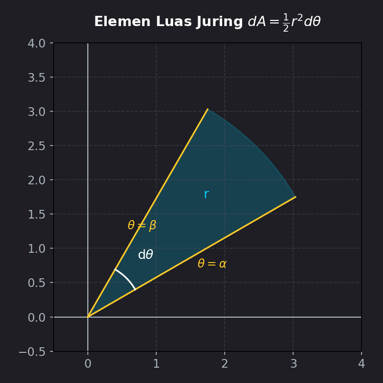
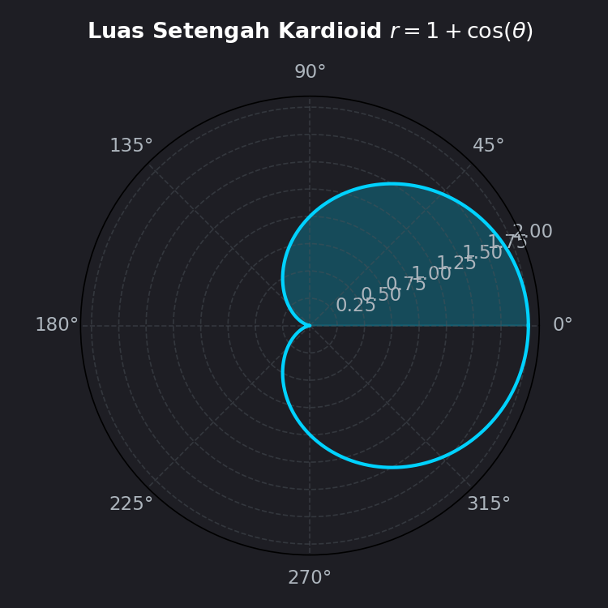
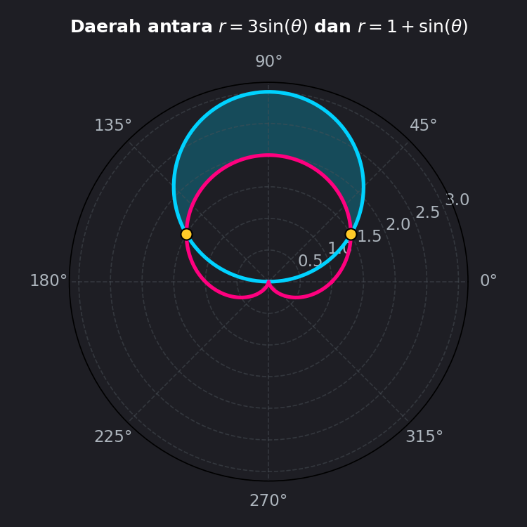

# Modul 6: Luas dan Volume dalam Koordinat Kutub

## 1. Pendahuluan
Setelah mempelajari cara menggambarkan grafik dalam koordinat kutub di Modul 5, sekarang kita akan menggunakan konsep integral untuk mengukur sifat-sifat geometris dari daerah kutub tersebut. 

Topik yang akan kita bahas meliputi:
- Bagaimana cara menghitung luas daerah di dalam suatu kurva kutub $r = f(\theta)$?
- Bagaimana menghitung volume yang terbentuk saat kurva kutub diputar mengelilingi sumbu koordinat?
- Bagaimana mencari panjang garis lengkung kutub?

**Perbedaan Utama dengan Kartesian:**
Pada koordinat Kartesian, kita membagi daerah menggunakan elemen persegi panjang tegak ($dA = y \, dx$). Namun pada koordinat kutub, karena kurva berputar radial dari titik asal, kita harus membaginya menjadi elemen berbentuk **juring lingkaran (sektor)**.

---

## 2. Konsep Dasar & Penurunan Rumus Luas
Mari kita perhatikan satu elemen juring lingkaran kecil yang memiliki sudut pusat $d\theta$ dan jari-jari $r$:

1.  **Luas Juring Lingkaran:** Dari geometri dasar, luas juring dengan sudut pusat $\theta$ (dalam radian) pada lingkaran berjari-jari $r$ adalah:
    $$\text{Luas Juring} = \frac{1}{2} r^2 \theta$$
2.  **Elemen Luas ($dA$):** Untuk sudut yang sangat kecil $d\theta$, elemen luasnya adalah:
    $$dA = \frac{1}{2} r^2 d\theta = \frac{1}{2} [f(\theta)]^2 d\theta$$
3.  **Integral Luas:** Dengan menjumlahkan seluruh juring kecil dari batas sudut $\theta = \alpha$ ke $\theta = \beta$, kita memperoleh total luas daerah:
    $$A = \int_{\alpha}^{\beta} \frac{1}{2} r^2 \, d\theta$$

---

## 3. Rumus Utama

---

### A. Luas Daerah Kurva Kutub Tunggal
Luas daerah yang dibatasi oleh $r = f(\theta)$ dari sudut $\theta = \alpha$ hingga $\theta = \beta$:
$$A = \int_{\alpha}^{\beta} \frac{1}{2} [f(\theta)]^2 \, d\theta$$

---

### B. Luas Daerah di Antara Dua Kurva Kutub
Jika suatu daerah dibatasi oleh kurva luar $r_{\text{luar}} = f(\theta)$ dan kurva dalam $r_{\text{dalam}} = g(\theta)$ dari $\theta = \alpha$ hingga $\theta = \beta$:
$$A = \int_{\alpha}^{\beta} \frac{1}{2} \left[ [f(\theta)]^2 - [g(\theta)]^2 \right] \, d\theta$$

---

### C. Volume Benda Putar di Koordinat Kutub
Ketika daerah yang dibatasi oleh kurva kutub diputar mengelilingi sumbu, kita menggunakan transformasi Kartesian ke kutub untuk merumuskan volumenya:

*   **Diputar terhadap Sumbu Polar (Sumbu-X / $\theta = 0$):**
    $$V = \int_{\alpha}^{\beta} \frac{2}{3} \pi r^3 \sin\theta \, d\theta$$
*   **Diputar terhadap Garis Sumbu Tegak (Sumbu-Y / $\theta = \frac{\pi}{2}$):**
    $$V = \int_{\alpha}^{\beta} \frac{2}{3} \pi r^3 \cos\theta \, d\theta$$

---

### D. Panjang Busur Kurva Kutub (Arc Length)
Panjang lintasan dari kurva $r = f(\theta)$ pada selang $\theta \in [\alpha, \beta]$:
$$L = \int_{\alpha}^{\beta} \sqrt{r^2 + \left(\frac{dr}{d\theta}\right)^2} \, d\theta$$

---

### E. Luas Permukaan Benda Putar Kutub
Luas selimut yang terbentuk saat kurva polar $r = f(\theta)$ diputar terhadap sumbu polar ($\theta = 0$):
$$S = \int_{\alpha}^{\beta} 2\pi r \sin\theta \sqrt{r^2 + \left(\frac{dr}{d\theta}\right)^2} \, d\theta$$

---

## 4. Langkah Pengerjaan Sistematis
1.  **Gambarkan Kurva:** Visualisasikan daerahnya. Tentukan kurva mana yang bertindak sebagai batas luar dan dalam.
2.  **Cari Batas Sudut ($\alpha$ dan $\beta$):**
    - Jika kurva tertutup tunggal (seperti kardioid): Batas integral biasanya $0$ sampai $2\pi$, atau gunakan simetri (misalnya $0$ sampai $\pi$ lalu hasilnya dikalikan $2$).
    - Jika daerah diapit dua kurva: Samakan kedua persamaan $f(\theta) = g(\theta)$ untuk mencari titik potongnya (nilai $\alpha$ dan $\beta$).
3.  **Terapkan Rumus:** Kuadratkan fungsi $r$, lalu kalikan dengan $\frac{1}{2}$.
4.  **Sederhanakan dengan Identitas Trigonometri:** Integral polar hampir selalu menghasilkan bentuk $\sin^2\theta$ atau $\cos^2\theta$. Ingat identitas reduksi pangkat:
    $$\sin^2\theta = \frac{1 - \cos(2\theta)}{2} \quad \text{dan} \quad \cos^2\theta = \frac{1 + \cos(2\theta)}{2}$$
5.  **Hitung Integral tentu.**

---

## 5. Contoh Soal & Pembahasan Langkah demi Langkah

### Contoh Soal 1: Luas Kardioid (Menggunakan Simetri)
Hitunglah luas daerah di dalam kurva kardioid $r = 1 + \cos\theta$.

#### Penyelesaian:

**Langkah 1: Sketsa Grafik dan Simetri**

Kurva kardioid ini simetris terhadap sumbu polar (bagian atas dan bawah sama). Untuk mempermudah perhitungan, kita dapat mengintegralkan setengah bagian atasnya saja (dari $\theta = 0$ hingga $\theta = \pi$), lalu hasilnya dikalikan $2$.

**Langkah 2: Susun Persamaan Integral**
$$\text{Total Luas } A = 2 \times \int_{0}^{\pi} \frac{1}{2} r^2 \, d\theta = \int_{0}^{\pi} [1 + \cos\theta]^2 \, d\theta$$

**Langkah 3: Jabarkan Integran**
$$[1 + \cos\theta]^2 = 1 + 2\cos\theta + \cos^2\theta$$
Gunakan identitas $\cos^2\theta = \frac{1 + \cos(2\theta)}{2}$:
$$1 + 2\cos\theta + \frac{1}{2} + \frac{1}{2}\cos(2\theta) = \frac{3}{2} + 2\cos\theta + \frac{1}{2}\cos(2\theta)$$

**Langkah 4: Hitung Nilai Integral**
$$A = \int_{0}^{\pi} \left( \frac{3}{2} + 2\cos\theta + \frac{1}{2}\cos(2\theta) \right) \, d\theta$$
$$A = \left[ \frac{3}{2}\theta + 2\sin\theta + \frac{1}{4}\sin(2\theta) \right]_{0}^{\pi}$$
Evaluasi batas atas ($\theta = \pi$):
$$\text{Evaluasi}(\pi) = \frac{3}{2}\pi + 2\sin(\pi) + \frac{1}{4}\sin(2\pi) = \frac{3}{2}\pi + 0 + 0 = \frac{3}{2}\pi$$
Evaluasi batas bawah ($\theta = 0$):
$$\text{Evaluasi}(0) = 0 + 0 + 0 = 0$$
Maka, Luas = $\frac{3}{2}\pi - 0 = \frac{3}{2}\pi \approx 4.71$ satuan luas.

**Jawaban:** Luas daerah di dalam kardioid tersebut adalah $\frac{3}{2}\pi$ satuan luas.

---

### Contoh Soal 2: Luas di Antara Dua Kurva Kutub
Tentukan luas daerah yang berada di **dalam** lingkaran $r = 3\sin\theta$ dan di **luar** kardioid $r = 1 + \sin\theta$.

#### Penyelesaian:

**Langkah 1: Visualisasi & Sketsa Grafik**

Kurva biru melambangkan lingkaran $r = 3\sin\theta$, dan kurva pink melambangkan kardioid $r = 1 + \sin\theta$. Daerah arsir biru muda adalah daerah di dalam lingkaran namun di luar kardioid.

**Langkah 2: Cari Batas Sudut (Titik Potong)**
Samakan kedua persamaan kurva:
$$3\sin\theta = 1 + \sin\theta$$
$$2\sin\theta = 1 \implies \sin\theta = \frac{1}{2}$$
Sudut $\theta$ pada satu putaran yang bernilai $\sin\theta = 1/2$ adalah:
$$\theta = \frac{\pi}{6} \quad (30^\circ) \quad \text{dan} \quad \theta = \frac{5\pi}{6} \quad (150^\circ)$$
Jadi, batas integrasinya adalah $\alpha = \frac{\pi}{6}$ dan $\beta = \frac{5\pi}{6}$.

**Langkah 3: Susun Integral Luas**
Pada interval tersebut, lingkaran berada di luar (jarak radial lebih jauh dari kutub), sehingga $r_{\text{luar}} = 3\sin\theta$ dan $r_{\text{dalam}} = 1 + \sin\theta$.
$$A = \int_{\pi/6}^{5\pi/6} \frac{1}{2} \left[ (3\sin\theta)^2 - (1 + \sin\theta)^2 \right] \, d\theta$$
$$A = \frac{1}{2} \int_{\pi/6}^{5\pi/6} \left[ 9\sin^2\theta - (1 + 2\sin\theta + \sin^2\theta) \right] \, d\theta$$
$$A = \frac{1}{2} \int_{\pi/6}^{5\pi/6} \left[ 8\sin^2\theta - 2\sin\theta - 1 \right] \, d\theta$$

**Langkah 4: Sederhanakan Integran**
Gunakan identitas $\sin^2\theta = \frac{1 - \cos 2\theta}{2}$:
$$8\sin^2\theta - 2\sin\theta - 1 = 8\left( \frac{1 - \cos 2\theta}{2} \right) - 2\sin\theta - 1$$
$$= 4(1 - \cos 2\theta) - 2\sin\theta - 1 = 3 - 4\cos 2\theta - 2\sin\theta$$

**Langkah 5: Hitung Integral**
$$A = \frac{1}{2} \int_{\pi/6}^{5\pi/6} \left( 3 - 4\cos 2\theta - 2\sin\theta \right) \, d\theta$$
$$A = \frac{1}{2} \left[ 3\theta - 2\sin 2\theta + 2\cos\theta \right]_{\pi/6}^{5\pi/6}$$
Evaluasi batas atas ($\theta = \frac{5\pi}{6}$):
$$\text{Evaluasi}\left(\frac{5\pi}{6}\right) = 3\left(\frac{5\pi}{6}\right) - 2\sin\left(\frac{5\pi}{3}\right) + 2\cos\left(\frac{5\pi}{6}\right) = \frac{5\pi}{2} - 2\left(-\frac{\sqrt{3}}{2}\right) + 2\left(-\frac{\sqrt{3}}{2}\right) = \frac{5\pi}{2}$$
Evaluasi batas bawah ($\theta = \frac{\pi}{6}$):
$$\text{Evaluasi}\left(\frac{\pi}{6}\right) = 3\left(\frac{\pi}{6}\right) - 2\sin\left(\frac{\pi}{3}\right) + 2\cos\left(\frac{\pi}{6}\right) = \frac{\pi}{2} - 2\left(\frac{\sqrt{3}}{2}\right) + 2\left(\frac{\sqrt{3}}{2}\right) = \frac{\pi}{2}$$
Kurangkan batas atas dan bawah, lalu kalikan $\frac{1}{2}$:
$$A = \frac{1}{2} \left( \frac{5\pi}{2} - \frac{\pi}{2} \right) = \frac{1}{2} \left( 2\pi \right) = \pi \approx 3.14 \text{ satuan luas}$$

**Jawaban:** Luas daerah tersebut adalah $\pi$ satuan luas.

---

### Contoh Soal 3: Volume Benda Putar Kutub
Hitunglah volume benda putar yang terbentuk ketika daerah di dalam kardioid $r = 1 + \cos\theta$ diputar mengelilingi sumbu polar ($\theta = 0$).

#### Penyelesaian:

**Langkah 1: Susun Integral Volume**
Rumus volume putar terhadap sumbu polar:
$$V = \int_{0}^{\pi} \frac{2}{3} \pi r^3 \sin\theta \, d\theta$$
(Kita hanya menggunakan interval $0$ sampai $\pi$ karena rotasi setengah daerah atas kardioid mengelilingi sumbu-x sudah mencakup seluruh benda putar secara lengkap 3D).

Substitusikan $r = 1 + \cos\theta$:
$$V = \frac{2}{3}\pi \int_{0}^{\pi} (1 + \cos\theta)^3 \sin\theta \, d\theta$$

**Langkah 2: Selesaikan dengan Metode Substitusi**
Misalkan:
$$u = 1 + \cos\theta \implies du = -\sin\theta \, d\theta \implies \sin\theta \, d\theta = -du$$
Ubah batas integral:
- Jika $\theta = 0 \implies u = 1 + \cos(0) = 2$
- Jika $\theta = \pi \implies u = 1 + \cos(\pi) = 0$

Substitusi variabel baru:
$$V = \frac{2}{3}\pi \int_{2}^{0} u^3 (-du) = \frac{2}{3}\pi \int_{0}^{2} u^3 \, du$$
$$V = \frac{2}{3}\pi \left[ \frac{1}{4}u^4 \right]_{0}^{2} = \frac{2}{3}\pi \left( \frac{1}{4}(16) - 0 \right) = \frac{2}{3}\pi (4) = \frac{8}{3}\pi \approx 8.38 \text{ satuan volume}$$

**Jawaban:** Volume benda putar tersebut adalah $\frac{8}{3}\pi$ satuan volume.

---

## 6. Ringkasan & Tips Ujian
*   **Rumus Utama:**
    - Luas: $A = \int \frac{1}{2} r^2 \, d\theta$
    - Volume terhadap sumbu-x: $V = \int \frac{2}{3}\pi r^3 \sin\theta \, d\theta$
*   **Kesalahan Paling Sering Terjadi di Ujian:**
    1.  **Lupa mengkuadratkan $r$:** Rumus luas polar adalah $\frac{1}{2} r^2$, bukan $\frac{1}{2} r$. Banyak mahasiswa melupakan pangkat dua ini karena terbiasa dengan integral Kartesian biasa.
    2.  **Lupa faktor $\frac{1}{2}$:** Pastikan pengali $\frac{1}{2}$ selalu ditulis di depan integral agar hasil akhir tidak berlipat ganda.
    3.  **Salah menentukan batas integrasi:** Untuk kurva mawar seperti $r = \cos(2\theta)$, satu kelopak disapu dari $\theta = -\frac{\pi}{4}$ ke $\theta = \frac{\pi}{4}$. Mengintegrasikan dari $0$ ke $2\pi$ akan menghitung kelopaknya berulang-ulang dan menghasilkan jawaban yang salah. Selalu gambarkan kurva terlebih dahulu!
