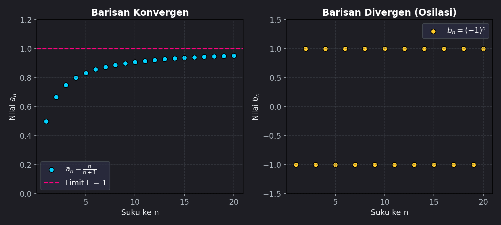
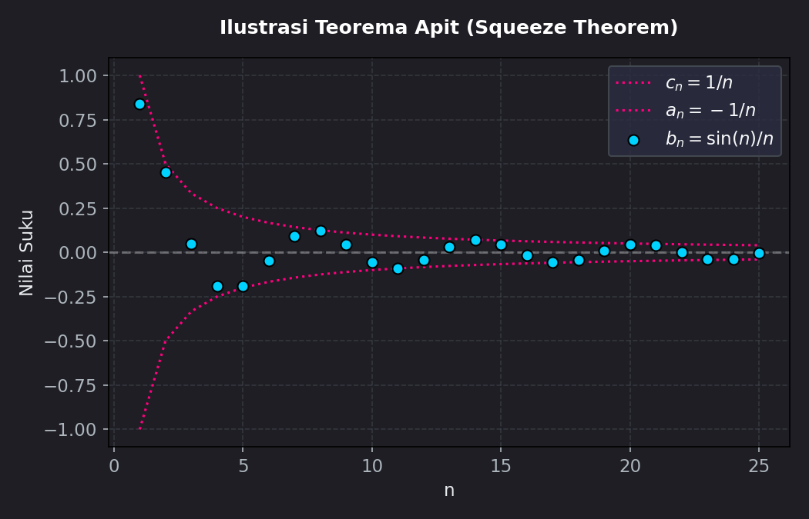
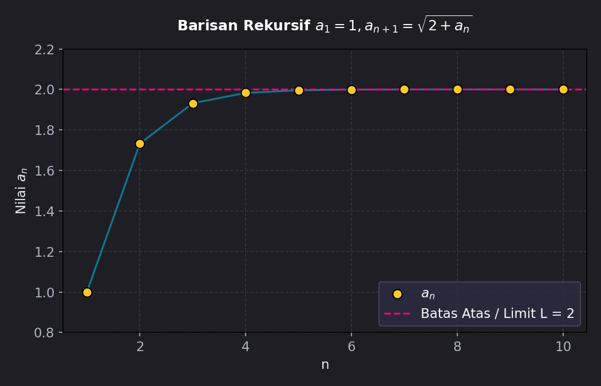

# Modul 7: Barisan Tak Hingga

## 1. Pendahuluan
Bab terakhir yang diujikan dalam EAS Kalkulus 2 adalah **Barisan Tak Hingga**. Topik ini sangat krusial karena merupakan landasan dasar sebelum mempelajari Deret Tak Hingga, Deret Taylor, dan Analisis Riil tingkat lanjut.

**Apa itu Barisan?**
Secara sederhana, **barisan** adalah sebuah daftar angka-angka yang disusun berdasarkan aturan tertentu secara berurutan:
$$a_1, a_2, a_3, a_4, \dots, a_n, \dots$$
di mana $a_1$ adalah suku pertama, $a_2$ suku kedua, dan $a_n$ disebut sebagai **suku umum** (suku ke-n).

Sebuah **barisan tak hingga** dilambangkan dengan notasi $\{a_n\}_{n=1}^{\infty}$ atau cukup $\{a_n\}$.

**Pertanyaan Terpenting:**
Saat indeks $n$ bertambah besar menuju tak hingga ($n \to \infty$), apakah suku-suku barisan tersebut akan **mendekati suatu angka spesifik (konvergen)**, ataukah nilainya **membesar tanpa batas / berosilasi (divergen)**?

---

## 2. Konsep Dasar & Konvergensi
Sebuah barisan $\{a_n\}$ dikatakan **konvergen** ke limit $L$, ditulis:
$$\lim_{n \to \infty} a_n = L$$
jika kita dapat membuat nilai-nilai $a_n$ berada sedekat mungkin dengan $L$ dengan syarat indeks $n$ diambil cukup besar. Jika limit tersebut tidak ada (nilainya menuju $\pm\infty$ atau berosilasi), maka barisan dikatakan **divergen**.

Berikut visualisasi perbedaan antara barisan yang konvergen dan barisan yang divergen (berosilasi):

Pada Gambar kiri, suku-suku barisan $a_n = \frac{n}{n+1}$ semakin merapat mendekati garis putus-putus merah ($L = 1$) saat $n$ membesar. Di Gambar kanan, barisan $b_n = (-1)^n$ melompat bolak-balik antara $-1$ dan $1$ sehingga tidak memiliki limit (divergen).

---

## 3. Teorema-Teorema Penting Pengujian Limit

Untuk menganalisis konvergensi barisan, kalkulus menyediakan beberapa alat bantu berupa teorema:

---

### A. Teorema Hubungan dengan Fungsi Kontinu
Jika $\lim_{x \to \infty} f(x) = L$ dan $f(n) = a_n$ untuk setiap bilangan bulat $n$, maka:
$$\lim_{n \to \infty} a_n = L$$
*Keuntungan:* Kita bisa menggunakan aturan **L'Hôpital** untuk menyelesaikan limit barisan dengan mengasumsikan variabelnya kontinu ($x$).

---

### B. Teorema Nilai Mutlak
Jika limit nilai mutlak suku barisan mendekati nol:
$$\lim_{n \to \infty} |a_n| = 0 \implies \lim_{n \to \infty} a_n = 0$$

---

### C. Teorema Apit (Squeeze Theorem)
Jika terdapat tiga barisan $\{a_n\}$, $\{b_n\}$, dan $\{c_n\}$ sedemikian rupa sehingga:
$$a_n \leq b_n \leq c_n \quad \text{untuk semua } n \geq N$$
dan $\lim_{n \to \infty} a_n = \lim_{n \to \infty} c_n = L$, maka:
$$\lim_{n \to \infty} b_n = L$$

*Contoh Visual:*

Barisan biru $b_n = \frac{\sin(n)}{n}$ "diapit" oleh batas atas $c_n = 1/n$ dan batas bawah $a_n = -1/n$. Karena kedua batas tersebut menuju $0$ saat $n \to \infty$, maka barisan biru juga terpaksa menuju $0$.

---

## 4. Kemonotonan, Keterbatasan, & Teorema MCT

Sering kali di ujian kita diminta membuktikan suatu barisan konvergen tanpa perlu mencari tahu nilai limitnya secara langsung. Ini dilakukan menggunakan sifat kemonotonan dan keterbatasan:

*   **Monoton Naik (Increasing):** $a_n \leq a_{n+1}$ untuk semua $n \geq 1$.
*   **Monoton Turun (Decreasing):** $a_n \geq a_{n+1}$ untuk semua $n \geq 1$.
*   **Terbatas di Atas (Bounded Above):** Ada angka $M$ sehingga $a_n \leq M$ untuk semua $n$.
*   **Terbatas di Bawah (Bounded Below):** Ada angka $m$ sehingga $a_n \geq m$ untuk semua $n$.

---

### Teorema Konvergensi Monoton (Monotone Convergence Theorem - MCT)
Setiap barisan yang **monoton** dan **terbatas** pasti **konvergen**.
- Jika barisan monoton naik dan terbatas di atas $\rightarrow$ konvergen.
- Jika barisan monoton turun dan terbatas di bawah $\rightarrow$ konvergen.

*Contoh Visual:*

Barisan rekursif pada grafik di atas terus meningkat (monoton naik) tetapi terhambat oleh batas atas horizontal ($M = 2$), sehingga ia terbukti konvergen mendekati limit $L=2$.

---

## 5. Contoh Soal & Pembahasan Langkah demi Langkah

### Contoh Soal 1: Limit Aljabar Sederhana
Tentukan apakah barisan $a_n = \frac{3n^2 + 1}{5n^2 - 2n}$ konvergen atau divergen. Jika konvergen, cari limitnya.

#### Penyelesaian:
Bagi pembilang dan penyebut dengan pangkat tertinggi dari $n$ (yaitu $n^2$):
$$\lim_{n \to \infty} \frac{3n^2 + 1}{5n^2 - 2n} = \lim_{n \to \infty} \frac{\frac{3n^2}{n^2} + \frac{1}{n^2}}{\frac{5n^2}{n^2} - \frac{2n}{n^2}}$$
$$\lim_{n \to \infty} a_n = \lim_{n \to \infty} \frac{3 + \frac{1}{n^2}}{5 - \frac{2}{n}}$$
Karena $\lim_{n \to \infty} \frac{1}{n^2} = 0$ dan $\lim_{n \to \infty} \frac{2}{n} = 0$:
$$\lim_{n \to \infty} a_n = \frac{3 + 0}{5 - 0} = \frac{3}{5}$$

**Jawaban:** Barisan **konvergen** ke $3/5$.

---

### Contoh Soal 2: Penggunaan Aturan L'Hôpital
Tentukan konvergensi barisan $a_n = \frac{\ln n}{n}$.

#### Penyelesaian:
Limit ini menghasilkan bentuk tak tentu $\frac{\infty}{\infty}$. Ubah barisan menjadi fungsi kontinu $f(x) = \frac{\ln x}{x}$ untuk mencari limit menggunakan aturan L'Hôpital:
$$\lim_{x \to \infty} \frac{\ln x}{x} \stackrel{\text{L'H}}{=} \lim_{x \to \infty} \frac{\frac{d}{dx}(\ln x)}{\frac{d}{dx}(x)} = \lim_{x \to \infty} \frac{1/x}{1} = 0$$
Karena $\lim_{x \to \infty} f(x) = 0$, maka menurut Teorema Hubungan Fungsi Kontinu:
$$\lim_{n \to \infty} \frac{\ln n}{n} = 0$$

**Jawaban:** Barisan **konvergen** ke $0$.

---

### Contoh Soal 3: Teorema Apit (Squeeze Theorem)
Tentukan limit dari barisan $a_n = \frac{(-1)^n}{n!}$.

#### Penyelesaian:
Karena pembilang berosilasi antara $-1$ dan $1$, kita bisa menuliskan ketidaksamaan batas berikut:
$$-1 \leq (-1)^n \leq 1$$
Bagi seluruh ruas dengan $n!$ (karena $n! > 0$, tanda ketidaksamaan tidak berubah):
$$-\frac{1}{n!} \leq \frac{(-1)^n}{n!} \leq \frac{1}{n!}$$
Sekarang hitung limit batas luar saat $n \to \infty$:
$$\lim_{n \to \infty} \left(-\frac{1}{n!}\right) = 0 \quad \text{dan} \quad \lim_{n \to \infty} \left(\frac{1}{n!}\right) = 0$$
Karena batas kiri dan kanan bernilai $0$, menurut Teorema Apit:
$$\lim_{n \to \infty} \frac{(-1)^n}{n!} = 0$$

**Jawaban:** Barisan **konvergen** ke $0$.

---

### Contoh Soal 4: Uji Kemonotonan
Tunjukkan bahwa barisan $a_n = \frac{n}{n+1}$ adalah barisan monoton naik.

#### Penyelesaian:
Kita uji selisih antara suku ke-$(n+1)$ dengan suku ke-$n$, yaitu $a_{n+1} - a_n$:
$$a_{n+1} - a_n = \frac{n+1}{(n+1)+1} - \frac{n}{n+1} = \frac{n+1}{n+2} - \frac{n}{n+1}$$
Samakan penyebutnya:
$$a_{n+1} - a_n = \frac{(n+1)^2 - n(n+2)}{(n+2)(n+1)}$$
$$a_{n+1} - a_n = \frac{(n^2 + 2n + 1) - (n^2 + 2n)}{(n+2)(n+1)} = \frac{1}{(n+2)(n+1)}$$
Karena $n$ adalah bilangan bulat positif ($n \geq 1$), pembilang dan penyebut bernilai positif, sehingga:
$$\frac{1}{(n+2)(n+1)} > 0 \implies a_{n+1} - a_n > 0 \implies a_{n+1} > a_n$$

**Jawaban:** Karena $a_{n+1} > a_n$ untuk seluruh $n \geq 1$, terbukti bahwa barisan tersebut **monoton naik**.

---

### Contoh Soal 5: Barisan Rekursif & Limit
Sebuah barisan didefinisikan secara rekursif oleh:
$$a_1 = 1, \quad a_{n+1} = \sqrt{2 + a_n}$$
Tunjukkan barisan ini konvergen dan tentukan limitnya.

#### Penyelesaian:

**Langkah 1: Buktikan Terbatas di Atas ($a_n < 2$) dengan Induksi Matematika**
- *Basis Induksi:* Untuk $n=1$, $a_1 = 1 < 2$. (Benar)
- *Langkah Induksi:* Asumsikan pernyataan benar untuk $n=k$, yaitu $a_k < 2$. Kita harus buktikan benar untuk $n=k+1$:
  $$a_{k+1} = \sqrt{2 + a_k}$$
  Karena $a_k < 2$, maka:
  $$a_{k+1} < \sqrt{2 + 2} = \sqrt{4} = 2 \quad \text{(Terbukti)}$$
Jadi, barisan terbatas di atas oleh $2$.

**Langkah 2: Buktikan Monoton Naik ($a_{n+1} > a_n$)**
Kita bandingkan $a_{n+1}$ dan $a_n$:
$$a_{n+1}^2 - a_n^2 = (2 + a_n) - a_n^2 = -(a_n^2 - a_n - 2) = -(a_n - 2)(a_n + 1)$$
Karena $a_n > 0$ dan $a_n < 2$ (dari pembuktian batas atas):
- $(a_n - 2) < 0$ (negatif)
- $(a_n + 1) > 0$ (positif)
Hasil kali $(a_n - 2)(a_n + 1)$ adalah negatif. Karena di depan kurung ada tanda minus:
$$-(a_n - 2)(a_n + 1) > 0 \implies a_{n+1}^2 - a_n^2 > 0 \implies a_{n+1} > a_n \quad \text{(Terbukti)}$$
Barisan terbukti monoton naik.

**Langkah 3: Cari Nilai Limit ($L$)**
Karena barisan monoton naik dan terbatas di atas, berdasarkan Teorema MCT, barisan **pasti konvergen** ke suatu limit $L$. 
Jika $\lim_{n \to \infty} a_n = L$, maka $\lim_{n \to \infty} a_{n+1} = L$ juga.
Ambil limit pada kedua ruas rumus rekursif:
$$\lim_{n \to \infty} a_{n+1} = \lim_{n \to \infty} \sqrt{2 + a_n} \implies L = \sqrt{2 + L}$$
Kuadratkan kedua ruas:
$$L^2 = 2 + L \implies L^2 - L - 2 = 0 \implies (L - 2)(L + 1) = 0$$
Diperoleh $L = 2$ atau $L = -1$.
Karena semua suku barisan bernilai positif (dimulai dari $a_1 = 1$), limit haruslah positif:
$$L = 2$$

**Jawaban:** Barisan konvergen ke **$2$**. (Lihat visualisasi Gambar 3).

---

## 6. Ringkasan & Tips Ujian
*   **Limit Penting untuk Diingat (Sering Keluar):**
    - $\lim_{n \to \infty} \frac{\ln n}{n} = 0$
    - $\lim_{n \to \infty} x^{1/n} = 1 \quad (x > 0)$
    - $\lim_{n \to \infty} \left(1 + \frac{x}{n}\right)^n = e^x$
    - $\lim_{n \to \infty} x^n = 0 \quad (\text{jika } |x| < 1)$
*   **Kesalahan Umum yang Harus Dihindari:**
    1.  **Tertukar antara Barisan (Sequences) dan Deret (Series):**
        - **Barisan** adalah daftar suku-suku $a_1, a_2, a_3, \dots$. Kita menguji apakah *suku terakhir* menuju suatu angka.
        - **Deret** adalah *jumlah* dari suku-suku $a_1 + a_2 + a_3 + \dots$.
        - Contoh: Barisan $a_n = 1/n$ konvergen ke $0$. Namun, deret harmonik $\sum_{n=1}^{\infty} \frac{1}{n}$ adalah divergen! Jangan sampai tertukar syarat konvergensi keduanya di kertas ujian.
    2.  **Mengabaikan syarat L'Hôpital:** Anda tidak boleh menurunkan langsung indeks diskrit $n$ (misalnya menulis $\frac{d}{dn}$). Selalu nyatakan dalam bentuk fungsi kontinu $x$ terlebih dahulu sebelum menerapkan turunan aturan L'Hôpital.
