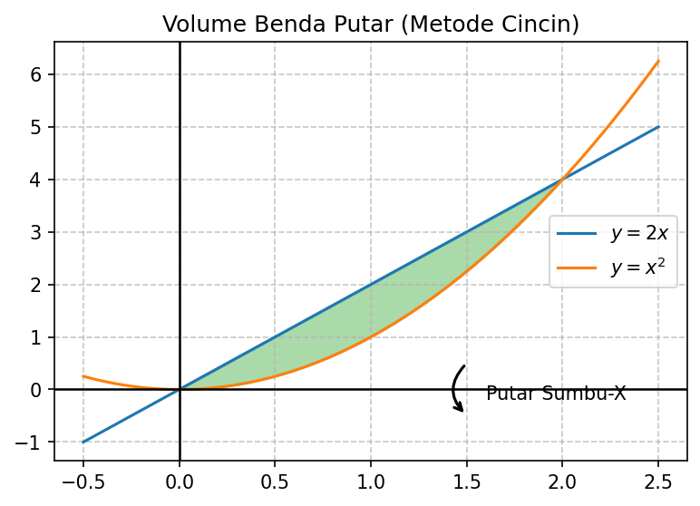
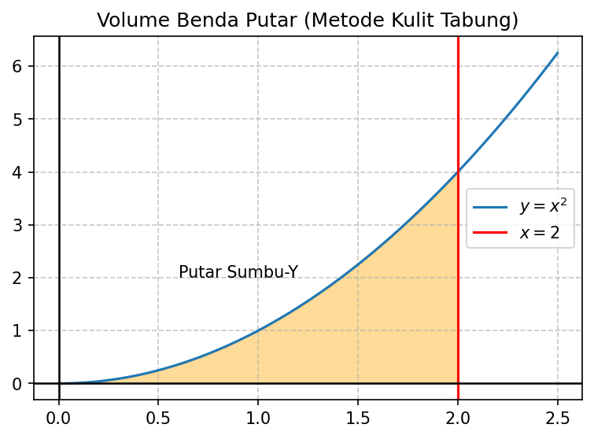

# Modul 8: Volume Benda Putar

## 1. Pendahuluan
Setelah mempelajari cara mencari luas daerah pada modul-modul sebelumnya, kita sekarang akan melangkah ke dimensi ketiga: menghitung volume benda tiga dimensi. Salah satu jenis benda tiga dimensi yang sangat penting dalam kalkulus dan teknik adalah **benda putar** (*solid of revolution*). Benda ini diperoleh dengan memutar suatu daerah dua dimensi di sekitar suatu garis lurus yang disebut sumbu putar.

Dalam kehidupan sehari-hari dan industri, banyak objek dibuat menggunakan prinsip ini, seperti:
- Botol, gelas, mangkuk, dan corong.
- Kubah bangunan.
- Komponen mesin seperti piston, roda gigi, dan poros dinamo.

**Prasyarat:** Sebelum memulai modul ini, pastikan Anda sudah menguasai:
1. Rumus integrasi dasar dan teknik substitusi.
2. Menggambar daerah yang dibatasi oleh beberapa kurva (Modul 1).
3. Menentukan batas-batas daerah (titik potong antar kurva).

---

## 2. Konsep Dasar
Ide dasar menghitung volume benda putar adalah memotong-motong benda tersebut menjadi irisan-irisan tipis yang volumenya mudah dihitung, lalu menjumlahkan semua volume irisan tersebut menggunakan integral tentu. 

Ada tiga cara utama untuk melakukan pemotongan ini tergantung bentuk daerah dan sumbu putarnya:
1. **Metode Cakram (Disk Method):** Irisan berupa silinder tipis (cakram) tanpa lubang. Digunakan jika daerah yang diputar menempel langsung pada sumbu putar.
2. **Metode Cincin (Washer Method):** Irisan berupa cakram berlubang di tengahnya (seperti cincin/washer). Digunakan jika terdapat jarak (rongga) antara daerah yang diputar dengan sumbu putar.
3. **Metode Kulit Tabung (Shell Method):** Pemotongan dilakukan sejajar dengan sumbu putar, sehingga menghasilkan lapisan-lapisan tipis berupa kulit tabung.

---

## 3. Rumus Utama

### A. Metode Cakram (Disk Method)
Jika daerah dibatasi oleh $y = f(x)$, sumbu-x, $x = a$, dan $x = b$, diputar terhadap sumbu-x:
- Elemen volumenya adalah silinder tipis dengan jari-jari $R = f(x)$ dan tinggi $dx$.
- Volume satu cakram: $dV = \pi [f(x)]^2 \, dx$.

$$V = \pi \int_{a}^{b} [f(x)]^2 \, dx$$

Jika daerah dibatasi oleh $x = g(y)$, sumbu-y, $y = c$, dan $y = d$, diputar terhadap sumbu-y:

$$V = \pi \int_{c}^{d} [g(y)]^2 \, dy$$

---

### B. Metode Cincin (Washer Method)
Jika daerah dibatasi oleh kurva luar $y = f(x)$ dan kurva dalam $y = g(x)$ pada interval $[a, b]$, diputar terhadap sumbu-x:
- Jari-jari luar: $R(x) = f(x)$
- Jari-jari dalam: $r(x) = g(x)$
- Volume satu cincin: $dV = \pi \left([R(x)]^2 - [r(x)]^2\right) \, dx$.

$$V = \pi \int_{a}^{b} \left([f(x)]^2 - [g(x)]^2\right) \, dx$$

Dengan cara yang sama, jika diputar terhadap sumbu-y (dengan fungsi dalam variabel $y$):

$$V = \pi \int_{c}^{d} \left([f(y)]^2 - [g(y)]^2\right) \, dy$$

---

### C. Metode Kulit Tabung (Shell Method)
Terkadang, menggunakan metode cakram atau cincin menghasilkan integral yang sangat rumit atau bahkan tidak bisa diselesaikan. Sebagai alternatif, kita bisa menggunakan metode kulit tabung.

Jika daerah di bawah kurva $y = f(x)$ dari $x = a$ ke $x = b$ diputar terhadap **sumbu-y**:
- Lapisan berupa tabung tegak dengan jari-jari rata-rata $x$, tinggi $f(x)$, dan tebal $dx$.
- Luas selimut tabung: $2\pi \times \text{jari-jari} \times \text{tinggi} = 2\pi x f(x)$.

$$V = 2\pi \int_{a}^{b} x \cdot f(x) \, dx$$

Jika diputar terhadap **sumbu-x** (dengan fungsi dalam variabel $y$ dari $y = c$ ke $y = d$):

$$V = 2\pi \int_{c}^{d} y \cdot g(y) \, dy$$

> [!NOTE]
> **Aturan Praktis Sumbu Putar & Variabel Integrasi:**
> - Pada metode **Cakram/Cincin**, arah strip tegak lurus sumbu putar. Putar sumbu-x $\rightarrow$ integralkan terhadap $dx$. Putar sumbu-y $\rightarrow$ integralkan terhadap $dy$.
> - Pada metode **Kulit Tabung**, arah strip sejajar sumbu putar. Putar sumbu-y $\rightarrow$ integralkan terhadap $dx$. Putar sumbu-x $\rightarrow$ integralkan terhadap $dy$.

---

## 4. Langkah Pengerjaan Sistematis

1. **Sketsa Daerah:** Gambarlah daerah dua dimensi yang akan diputar dan tandai sumbu putarnya.
2. **Pilih Metode:**
   - Gunakan **Metode Cakram/Cincin** jika lebih mudah mengintegralkan dengan arah yang tegak lurus sumbu putar.
   - Gunakan **Metode Kulit Tabung** jika lebih mudah mengintegralkan dengan arah yang sejajar sumbu putar.
3. **Tentukan Batas Integrasi:** Cari titik-titik potong antar kurva untuk menentukan batas atas dan batas bawah.
4. **Tentukan Jari-Jari (dan Tinggi):**
   - Untuk Cincin: Tentukan persamaan jari-jari luar $R(x)$ atau $R(y)$ dan jari-jari dalam $r(x)$ atau $r(y)$.
   - Untuk Kulit Tabung: Tentukan jari-jari (biasanya $x$ atau $y$) dan tinggi tabung (selisih kurva atas dan kurva bawah).
5. **Susun Integral:** Masukkan fungsi dan batas ke dalam rumus yang sesuai. Jangan lupa koefisien $\pi$ atau $2\pi$.
6. **Hitung Integral:** Selesaikan integral untuk mendapatkan volume. Hasil volume harus selalu bernilai positif.

---

## 5. Contoh Soal & Pembahasan Langkah demi Langkah

### Contoh Soal 1: Metode Cincin
Tentukan volume benda putar yang terbentuk jika daerah yang dibatasi oleh parabola $y = x^2$ dan garis $y = 2x$ diputar sekali mengelilingi sumbu-x.

#### Penyelesaian:

**Langkah 1: Sketsa Grafik dan Visualisasi**
Berikut adalah visualisasi daerah yang dibatasi oleh $y = 2x$ dan $y = x^2$:

Daerah ini berada di antara sumbu-x dan kurva, memiliki rongga jika diputar terhadap sumbu-x, sehingga kita memilih **Metode Cincin**. Strip tegak lurus sumbu putar (sumbu-x), jadi kita mengintegralkan terhadap $dx$.

**Langkah 2: Mencari Titik Potong (Batas Integral)**
Samakan kedua fungsi:
$$x^2 = 2x$$
$$x^2 - 2x = 0$$
$$x(x - 2) = 0$$
Diperoleh titik potong pada $x = 0$ dan $x = 2$. Batas integrasinya adalah $a = 0$ dan $b = 2$.

**Langkah 3: Menentukan Jari-Jari Luar dan Jari-Jari Dalam**
Pada interval $[0, 2]$, garis $y = 2x$ berada di atas parabola $y = x^2$.
- Jari-jari luar (jarak terjauh dari sumbu putar): $R(x) = 2x$
- Jari-jari dalam (jarak terdekat dari sumbu putar): $r(x) = x^2$

**Langkah 4: Menyusun Integral**
$$V = \pi \int_{0}^{2} \left([R(x)]^2 - [r(x)]^2\right) \, dx$$
$$V = \pi \int_{0}^{2} \left((2x)^2 - (x^2)^2\right) \, dx$$
$$V = \pi \int_{0}^{2} (4x^2 - x^4) \, dx$$

**Langkah 5: Menghitung Nilai Integral**
$$V = \pi \left[ \frac{4}{3}x^3 - \frac{1}{5}x^5 \right]_{0}^{2}$$
Evaluasi pada batas atas ($x = 2$):
$$V = \pi \left( \frac{4}{3}(2)^3 - \frac{1}{5}(2)^5 \right) - 0$$
$$V = \pi \left( \frac{32}{3} - \frac{32}{5} \right)$$
Samakan penyebut menjadi 15:
$$V = \pi \left( \frac{160}{15} - \frac{96}{15} \right) = \frac{64\pi}{15} \approx 13.40 \text{ satuan volume}$$

**Jawaban:** Volume benda putar tersebut adalah $\frac{64\pi}{15}$ satuan volume.

---

### Contoh Soal 2: Metode Kulit Tabung
Tentukan volume benda putar yang terbentuk jika daerah yang dibatasi oleh kurva $y = x^2$, sumbu-x, dan garis $x = 2$ diputar mengelilingi sumbu-y.

#### Penyelesaian:

**Langkah 1: Sketsa Grafik dan Visualisasi**
Berikut adalah visualisasi daerah tersebut:

Sumbu putarnya adalah **sumbu-y**. 
Jika kita menggunakan metode cincin, kita harus mengubah fungsi menjadi $x = \sqrt{y}$ dan membagi daerah integrasi. 
Namun, jika menggunakan **Metode Kulit Tabung**, kita menggunakan strip vertikal (sejajar sumbu-y) dan mengintegralkannya terhadap $dx$, yang jauh lebih mudah karena kita tidak perlu mengubah persamaan.

**Langkah 2: Menentukan Batas Integrasi**
Daerah dibatasi dari sumbu-y ($x = 0$) hingga garis $x = 2$.
Jadi, batas integrasinya adalah $a = 0$ dan $b = 2$.

**Langkah 3: Menentukan Jari-Jari dan Tinggi Tabung**
Untuk putaran terhadap sumbu-y:
- Jari-jari tabung ($r$): jarak horizontal dari sumbu putar (sumbu-y) ke strip, yaitu $r = x$.
- Tinggi tabung ($h$): tinggi strip vertikal, yaitu $h = y = x^2$.

**Langkah 4: Menyusun Integral**
$$V = 2\pi \int_{a}^{b} \text{jari-jari} \times \text{tinggi} \, dx$$
$$V = 2\pi \int_{0}^{2} x \cdot x^2 \, dx$$
$$V = 2\pi \int_{0}^{2} x^3 \, dx$$

**Langkah 5: Menghitung Nilai Integral**
$$V = 2\pi \left[ \frac{1}{4}x^4 \right]_{0}^{2}$$
Evaluasi pada batas atas ($x = 2$):
$$V = 2\pi \left( \frac{1}{4}(2)^4 \right) - 0$$
$$V = 2\pi \left( 4 \right) = 8\pi \approx 25.13 \text{ satuan volume}$$

**Jawaban:** Volume benda putar tersebut adalah $8\pi$ satuan volume.

---

## 6. Ringkasan & Tips Ujian

* **Cakram vs Cincin vs Kulit Tabung:**
  - Metode **Cakram** digunakan untuk 1 kurva menempel sumbu putar ($V = \pi \int R^2$).
  - Metode **Cincin** digunakan untuk 2 kurva berlubang ($V = \pi \int [R^2 - r^2]$).
  - Metode **Kulit Tabung** sering kali menjadi penyelamat jika integral cakram/cincin mengharuskan kita mencari invers fungsi ($x = f^{-1}(y)$) yang sulit dicari ($V = 2\pi \int r \cdot h$).

* **Kesalahan Umum di Lembar Jawaban:**
  1. **Mengurangi Jari-Jari Baru Dikuadratkan:** Ini adalah kesalahan fatal aljabar yang sering ditemui.
     $$\text{SALAH: } V = \pi \int (R - r)^2 \, dx$$
     $$\text{BENAR: } V = \pi \int (R^2 - r^2) \, dx$$
  2. **Menukar $\pi$ dan $2\pi$:** Ingat bahwa Cakram/Cincin menggunakan $\pi$ (dari luas lingkaran $\pi R^2$), sedangkan Kulit Tabung menggunakan $2\pi$ (dari keliling lingkaran $2\pi r$).
  3. **Salah Menentukan Jari-Jari terhadap Sumbu Putar Bukan Sumbu Koordinat:** Jika diputar terhadap garis $x = 3$ (bukan sumbu-y), maka jari-jari kulit tabung bukan lagi $x$, melainkan $|3 - x|$. Selalu periksa jarak strip ke sumbu putarnya.
