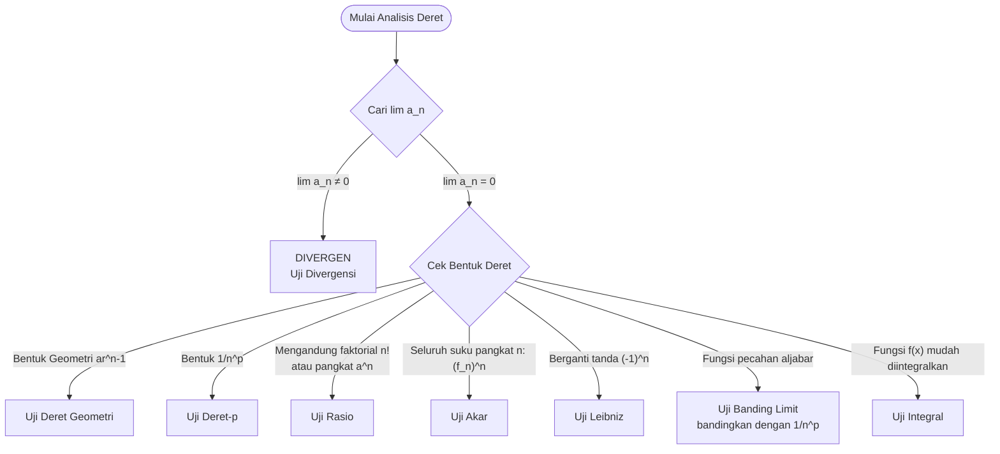

# Modul 11: Deret Tak Hingga

## 1. Pendahuluan
Pada Modul 7, kita telah mempelajari **barisan tak hingga**, yaitu urutan bilangan $a_1, a_2, a_3, \dots, a_n$ yang terus berlanjut tanpa akhir. Sekarang, kita akan membahas topik yang sangat berkaitan erat namun sering kali disalahpahami perbedaannya: **deret tak hingga** (*infinite series*).

Deret tak hingga adalah penjumlahan dari semua suku-suku dalam barisan tak hingga tersebut:
$$S = a_1 + a_2 + a_3 + \dots + a_n + \dots = \sum_{n=1}^{\infty} a_n$$

Bagaimana mungkin kita menjumlahkan tak hingga banyak bilangan positif dan menghasilkan sebuah nilai yang berhingga (tidak meledak menjadi tak hingga)? Konsep ini sering diilustrasikan dengan pemotongan kue: jika Anda memiliki satu loyang kue, lalu Anda memakannya setengah ($\frac{1}{2}$), keesokan harinya setengah dari sisanya ($\frac{1}{4}$), lalu setengahnya lagi ($\frac{1}{8}$), dan seterusnya, total kue yang Anda makan tidak akan pernah melebihi 1 loyang.
$$\frac{1}{2} + \frac{1}{4} + \frac{1}{8} + \frac{1}{16} + \dots = 1$$

**Prasyarat:** Sebelum memulai modul ini, pastikan Anda sudah menguasai:
1. Konsep limit barisan ($\lim_{n \to \infty} a_n$) dari Modul 7.
2. Aturan L'Hopital untuk menghitung limit tak tentu.
3. Integral tidak wajar (karena ada uji konvergensi menggunakan integral).
4. Pecahan parsial aljabar.

---

## 2. Konsep Dasar

### A. Jumlah Parsial (Partial Sum)
Karena kita tidak bisa benar-benar menjumlahkan tak hingga suku satu per satu secara fisik, kita mendefinisikan deret melalui **barisan jumlah parsial** $\{S_k\}$:
- $S_1 = a_1$
- $S_2 = a_1 + a_2$
- $S_3 = a_1 + a_2 + a_3$
- $S_k = a_1 + a_2 + \dots + a_k = \sum_{n=1}^{k} a_n$

### B. Definisi Konvergensi Deret
Deret tak hingga $\sum_{n=1}^{\infty} a_n$ dikatakan **konvergen** jika barisan jumlah parsialnya $\{S_k\}$ memiliki limit yang berhingga:
$$\lim_{k \to \infty} S_k = S$$
Jika limit tersebut ada dan bernilai $S$, maka $S$ adalah jumlah deret tersebut. Jika limitnya tidak ada atau bernilai tak hingga ($\pm\infty$), maka deret tersebut dikatakan **divergen**.

---

## 3. Rumus Utama & Uji Konvergensi

### A. Deret Geometri
Deret berbentuk $\sum_{n=1}^{\infty} a r^{n-1} = a + ar + ar^2 + \dots$ di mana $a$ adalah suku pertama dan $r$ adalah rasio:
- **Konvergen** jika $|r| < 1$, dengan jumlah total:
  $$S = \frac{a}{1 - r}$$
- **Divergen** jika $|r| \ge 1$.

---

### B. Deret Teleskopik
Deret di mana suku-suku bagian tengahnya saling menghilangkan ketika ditulis secara parsial. Nilainya dicari dengan mencari rumus $S_k$ terlebih dahulu, lalu di-limit-kan $k \to \infty$.

---

### C. Uji Divergensi (Uji Suku ke-n)
Ini adalah uji pertama dan paling sederhana yang harus dilakukan pada deret apa pun:
- Jika $\lim_{n \to \infty} a_n \neq 0$ (atau limit tidak ada), maka deret $\sum a_n$ **pasti divergen**.
- Jika $\lim_{n \to \infty} a_n = 0$, uji ini **tidak memberikan kesimpulan** (deret bisa konvergen, bisa juga divergen).

---

### D. Uji Deret-p (p-Series)
Deret berbentuk $\sum_{n=1}^{\infty} \frac{1}{n^p}$:
- **Konvergen** jika $p > 1$.
- **Divergen** jika $p \le 1$. (Jika $p = 1$, disebut deret harmonik $\sum \frac{1}{n}$, yang terbukti divergen).

---

### E. Uji Integral
Jika $f(x)$ adalah fungsi yang kontinu, positif, dan monoton turun pada interval $[1, \infty)$, di mana $a_n = f(n)$:
- $\sum_{n=1}^{\infty} a_n$ konvergen $\iff \int_{1}^{\infty} f(x) \, dx$ konvergen.

---

### F. Uji Banding (Comparison Tests)
1. **Uji Banding Langsung:**
   - Jika $0 \le a_n \le b_n$ untuk semua $n$, dan $\sum b_n$ konvergen, maka $\sum a_n$ juga **konvergen**.
   - Jika $0 \le b_n \le a_n$ untuk semua $n$, dan $\sum b_n$ divergen, maka $\sum a_n$ juga **divergen**.
2. **Uji Banding Limit:**
   Jika $a_n > 0$ dan $b_n > 0$, hitung nilai limit perbandingannya:
   $$L = \lim_{n \to \infty} \frac{a_n}{b_n}$$
   - Jika $0 < L < \infty$, maka kedua deret sama-sama konvergen atau sama-sama divergen.

---

### G. Uji Rasio (Ratio Test)
Sangat cocok untuk deret yang mengandung faktorial ($n!$) atau pangkat variabel ($a^n$):
Hitunglah:
$$\rho = \lim_{n \to \infty} \left| \frac{a_{n+1}}{a_n} \right|$$
- Jika $\rho < 1$, deret **konvergen mutlak**.
- Jika $\rho > 1$ (atau $\rho = \infty$), deret **divergen**.
- Jika $\rho = 1$, uji **gagal** (gunakan uji lain).

---

### H. Uji Akar (Root Test)
Sangat cocok untuk deret yang seluruh sukunya dipangkatkan $n$:
Hitunglah:
$$L = \lim_{n \to \infty} \sqrt[n]{|a_n|}$$
- Jika $L < 1$, deret **konvergen mutlak**.
- Jika $L > 1$ (atau $L = \infty$), deret **divergen**.
- Jika $L = 1$, uji **gagal**.

---

### I. Deret Berganti Tanda (Alternating Series) & Uji Leibniz
Deret yang sukunya bergantian positif dan negatif: $\sum (-1)^{n-1} b_n$ atau $\sum (-1)^n b_n$ dengan $b_n > 0$.
Deret ini **konvergen** jika memenuhi dua syarat:
1. $b_{n+1} \le b_n$ untuk semua $n$ (monoton turun).
2. $\lim_{n \to \infty} b_n = 0$.

---

### J. Konvergensi Mutlak vs Bersyarat
- **Konvergen Mutlak:** Deret $\sum a_n$ konvergen mutlak jika $\sum |a_n|$ konvergen.
- **Konvergen Bersyarat:** Deret $\sum a_n$ konvergen bersyarat jika $\sum a_n$ konvergen tetapi $\sum |a_n|$ divergen.

---

## 4. Langkah Pengerjaan Sistematis (Strategi Pemilihan Uji)

Gunakan panduan berikut untuk memilih uji konvergensi yang tepat saat ujian:

---

## 5. Contoh Soal & Pembahasan Langkah demi Langkah

### Contoh Soal 1: Deret Geometri
Tentukan apakah deret $\sum_{n=1}^{\infty} \frac{3^{n+1}}{5^n}$ konvergen atau divergen. Jika konvergen, hitung jumlahnya.

#### Penyelesaian:

**Langkah 1: Uraikan Bentuk Deret**
Kita manipulasi bentuk pecahan berpangkat agar menyerupai rumus deret geometri standar $\sum a r^{n-1}$:
$$\frac{3^{n+1}}{5^n} = \frac{3 \cdot 3^n}{5^n} = 3 \cdot \left(\frac{3}{5}\right)^n$$

Tulis beberapa suku pertama dengan memasukkan nilai $n = 1, 2, 3$:
- Untuk $n = 1 \rightarrow a_1 = 3 \cdot \frac{3}{5} = \frac{9}{5}$
- Untuk $n = 2 \rightarrow a_2 = 3 \cdot \frac{9}{25} = \frac{27}{25}$
- Untuk $n = 3 \rightarrow a_3 = 3 \cdot \frac{27}{125} = \frac{81}{125}$

**Langkah 2: Tentukan Suku Pertama ($a$) dan Rasio ($r$)**
- Suku pertama: $a = \frac{9}{5}$
- Rasio: $r = \frac{a_2}{a_1} = \frac{27/25}{9/5} = \frac{27}{25} \cdot \frac{5}{9} = \frac{3}{5}$

**Langkah 3: Uji Konvergensi**
Karena $|r| = \left|\frac{3}{5}\right| = 0.6 < 1$, maka deret ini **konvergen**.

**Langkah 4: Hitung Jumlah Deret**
$$S = \frac{a}{1 - r} = \frac{\frac{9}{5}}{1 - \frac{3}{5}} = \frac{\frac{9}{5}}{\frac{2}{5}} = \frac{9}{5} \cdot \frac{5}{2} = \frac{9}{2} = 4.5$$

**Jawaban:** Deret tersebut konvergen dengan jumlah $4.5$ (atau $\frac{9}{2}$).

---

### Contoh Soal 2: Uji Rasio (Faktorial)
Tentukan konvergensi dari deret $\sum_{n=1}^{\infty} \frac{n!}{3^n}$.

#### Penyelesaian:

**Langkah 1: Identifikasi Uji yang Tepat**
Karena deret ini melibatkan bentuk faktorial ($n!$), maka **Uji Rasio** adalah pilihan terbaik.

**Langkah 2: Tentukan Suku $a_n$ dan $a_{n+1}$**
- $a_n = \frac{n!}{3^n}$
- $a_{n+1} = \frac{(n+1)!}{3^{n+1}} = \frac{(n+1) \cdot n!}{3 \cdot 3^n}$

**Langkah 3: Hitung Limit Rasio $\rho$**
$$\rho = \lim_{n \to \infty} \left| \frac{a_{n+1}}{a_n} \right|$$
$$\rho = \lim_{n \to \infty} \left( \frac{(n+1) \cdot n!}{3 \cdot 3^n} \cdot \frac{3^n}{n!} \right)$$
Coret $n!$ dan $3^n$ yang saling membagi:
$$\rho = \lim_{n \to \infty} \frac{n+1}{3} = \infty$$

**Langkah 4: Tarik Kesimpulan**
Karena nilai $\rho = \infty > 1$, berdasarkan Uji Rasio, deret $\sum_{n=1}^{\infty} \frac{n!}{3^n}$ adalah **divergen**.

**Jawaban:** Deret tersebut divergen.

---

### Contoh Soal 3: Uji Banding Limit
Selidiki apakah deret $\sum_{n=1}^{\infty} \frac{1}{n^2 + 3n}$ konvergen atau divergen.

#### Penyelesaian:

**Langkah 1: Pilih Deret Pembanding ($b_n$)**
Untuk nilai $n$ yang sangat besar, suku dominan pada penyebut adalah $n^2$. Oleh karena itu, kita pilih deret pembanding:
$$b_n = \frac{1}{n^2}$$
Kita tahu bahwa $\sum_{n=1}^{\infty} b_n = \sum_{n=1}^{\infty} \frac{1}{n^2}$ adalah **deret-p** dengan $p = 2 > 1$, sehingga deret pembanding ini **konvergen**.

**Langkah 2: Hitung Limit Perbandingan $L$**
$$L = \lim_{n \to \infty} \frac{a_n}{b_n} = \lim_{n \to \infty} \frac{\frac{1}{n^2 + 3n}}{\frac{1}{n^2}}$$
$$L = \lim_{n \to \infty} \frac{n^2}{n^2 + 3n}$$
Bagi pembilang dan penyebut dengan $n^2$:
$$L = \lim_{n \to \infty} \frac{1}{1 + \frac{3}{n}} = \frac{1}{1 + 0} = 1$$

**Langkah 3: Tarik Kesimpulan**
Karena $L = 1$ (memenuhi syarat $0 < L < \infty$), dan deret pembanding $\sum b_n$ konvergen, maka berdasarkan Uji Banding Limit, deret asli $\sum_{n=1}^{\infty} \frac{1}{n^2 + 3n}$ juga **konvergen**.

**Jawaban:** Deret tersebut konvergen.

---

## 6. Ringkasan & Tips Ujian

* **Mitos Terbesar Deret (Hati-Hati!):**
  > [!WARNING]
  > **"Jika limit suku ke-n bernilai 0, maka deret pasti konvergen"** $\rightarrow$ Ini adalah **kesalahan paling umum** yang ditemui dosen pemeriksa ujian.
  > Contoh klasik: Deret harmonik $\sum_{n=1}^{\infty} \frac{1}{n}$ memiliki $\lim_{n \to \infty} \frac{1}{n} = 0$, namun jumlah total deret ini adalah **divergen** menuju tak hingga. Ingat: syarat $\lim a_n = 0$ hanyalah syarat perlu, bukan syarat cukup untuk konvergensi.

* **Urutan Prioritas Uji saat Ujian:**
  1. Selalu lakukan **Uji Divergensi** secara mental dulu. Jika limitnya bukan 0, langsung simpulkan divergen.
  2. Jika suku mengandung faktorial, jangan berpikir dua kali, langsung gunakan **Uji Rasio**.
  3. Gunakan **Uji Banding Limit** untuk fungsi aljabar rasional.

* **Kesalahan Hitung Faktorial:**
  Ingat definisi faktorial: $(n+1)! = (n+1) \cdot n!$. 
  Jangan menulis $(n+1)! = n! + 1!$, ini aljabar yang salah.
